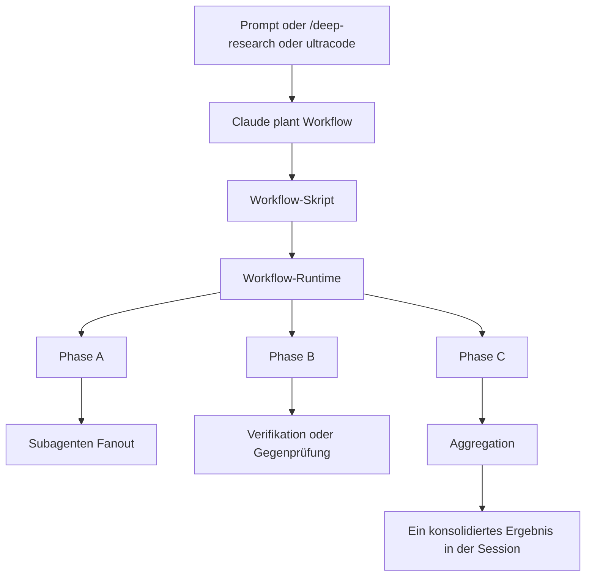
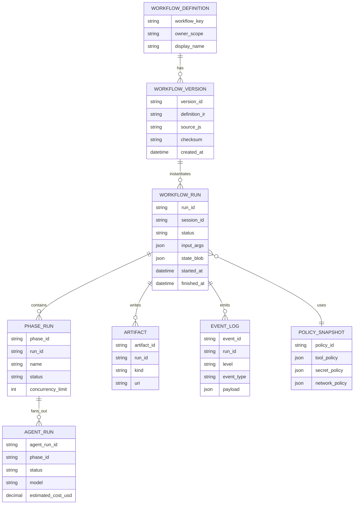

# Claude Code Workflows und eine mögliche Portierung in einen generischen Harness

## Executive Summary

Claude Code **Dynamic Workflows** sind nach der aktuellen offiziellen Dokumentation kein bloßes „Prompt-Rezept“, sondern ein **hintergrundlaufender Orchestrierungsmodus**, in dem Claude für eine Aufgabe ein **JavaScript-Skript** erzeugt, dieses gegen viele Subagents ausführt und am Ende **ein konsolidiertes Ergebnis** in die Sitzung zurückliefert. Anthropic positioniert Workflows ausdrücklich für Aufgaben, die eine einzelne Konversation nur schwer koordinieren kann: großflächige Codebase-Audits, Migrationen über Hunderte Dateien, tiefere Recherchen mit Quellenabgleich und andere Multi-Agenten-Muster. Die offizielle Runtime dokumentiert dabei vor allem **Ausführungs- und Bediensemantik**: Phasen, Agentenzahlen, Token- und Laufzeitmetriken, Pausieren/Fortsetzen, Run-Management, Dateispeicherung unter `.claude/workflows/` bzw. `~/.claude/workflows/`, strukturierte `args`, Resumierbarkeit innerhalb derselben Session sowie harte Grenzen wie **maximal 16 gleichzeitige Agents** und **1.000 Agents pro Run**. citeturn13view0turn14view0turn17view0turn30search0

Für eine Portierung in einen anderen, noch **nicht spezifizierten Harness** ist die wichtigste Schlussfolgerung: **nicht die undokumentierte Claude-DSL nachbauen, sondern die stabile Semantik nachbauen**. Der belastbare Kern ist: **Planner → Workflow-Definition → Run-State → Phasen → Agent-Fanout → Aggregation → Rückgabe**, ergänzt um **Session-/Run-Persistenz**, **Policy-/Permission-Schicht**, **Progress-UI**, **Kosten-/Token-Telemetrie** und **sichere Tool-/Credential-Isolation**. Offizielle Anthropic-Quellen sind derzeit stark bei **Produktverhalten, Deployment, Sessions, Hooks, Observability und Sicherheit**, aber **schwächer bei einer formalen öffentlichen Referenz des Workflow-Sprachkerns**. Die öffentliche Dokusuche weist zwar auf einen Workflow-Tool-Eintrag in der TypeScript-SDK-Referenz hin, die extrahierbare Referenzansicht dokumentiert diesen Eintrag derzeit nicht vollständig. In Anthropic-GitHub-Issues tauchen zusätzlich Hinweise auf Primitiven wie `parallel()` und `pipeline()` auf; diese sind jedoch als **Hinweise aus dem offiziellen Repository**, nicht als stabilisierte Spezifikation, zu behandeln. citeturn31search6turn28search0turn26search4turn13view0turn35view0

Die empfohlene Implementierungsstrategie ist deshalb zweistufig: **zuerst ein generisches, deterministisches Workflow-IR/AST** mit Phasen, Verzweigungen, Parallel-Fanout, Fehlerpolitik, Budgets und Agent-Aufrufen einführen; **danach optional einen Claude-kompatiblen JS-Adapter** ergänzen, sobald Anthropic die Sprachgrenzen stabiler dokumentiert. So erhält man hohe Portabilität, geringeres Lock-in und eine robustere Sicherheits- und Betriebsarchitektur. citeturn13view0turn36view3turn36view4turn36view2

## Quellenlage und begriffliche Einordnung

Anthropic verwendet in der offiziellen Dokumentation primär die Begriffe **workflow**, **phase** und **agent**. Der Nutzerwunsch nach „nodes“ passt konzeptionell, ist aber **kein klar dokumentiertes First-Class-Objekt** in der öffentlich sichtbaren Doku. Was offiziell sichtbar ist: Ein Workflow ist ein **Skript**, das viele **Subagents** orchestriert; die UI zeigt **Phasen** an, und in jeder Phase sind **Agents**, Tokenzahlen und Laufzeiten sichtbar. Für eine Portierung sollte man „Node“ deshalb als **abstrakte Harness-Einheit** modellieren, die sich in Claude Code am ehesten als **Phase** oder **Agent-Invocation innerhalb einer Phase** manifestiert. citeturn13view0turn14view0

Wichtig ist auch die Abgrenzung zu anderen Claude-Code-Konstrukten. Anthropic selbst unterscheidet: **Subagents** sind delegierte Worker innerhalb einer Konversation; **Skills** sind promptbasierte, auf Abruf ladbare Fähigkeiten; **Agent Teams** sind mehrere koordinierte Sitzungen; **Workflows** verschieben den eigentlichen Plan in ein **ausführbares Skript**. Intermediate Results liegen dann nicht mehr im Kontextfenster, sondern in **Skriptvariablen**. Diese Verschiebung – von „LLM hält den Plan“ zu „Runtime hält den Plan“ – ist der qualitativ wichtigste Architekturunterschied. citeturn13view0turn12view0turn13view1

Anthropics offizielle Launch-Kommunikation und die laufend aktualisierten Docs sind konsistent in der Grundidee, aber nicht in jedem Rollout-Detail. Der Launch-Post zu Opus 4.8 beschrieb Workflows zunächst als Research Preview und nannte „hundreds of parallel subagents“, während die aktuellere Produktdoku präzisere operative Grenzen angibt: **16 concurrent / 1,000 total**. Für eine Implementierung sollte man die **präzisere, spätere Produktdoku** als Quellautorität verwenden und Marketing-/Launchtexte nur ergänzend auswerten. citeturn29view0turn14view0

Die offizielle Dokumentation ist reich an Informationen zu **Bedienung, Sicherheit, Hosting, Session-Speicherung und Observability**, aber sie lässt derzeit eine **formale, vollständige Workflow-Sprachreferenz** offen. Die offizielle Dokusuche zeigt zwar einen Hinweis auf ein **Workflow tool** in der TypeScript-SDK-Referenz, die gerenderte Referenz liefert in der extrahierbaren HTML-Ansicht jedoch keine ebenso vollständige Spezifizierung wie etwa für `Agent`, `Bash` oder `Read`. Das ist für eine Gegenimplementierung zentral: Man kann die **Semantik** gesichert nachbauen, die **konkrete DSL** aber derzeit nur teilweise. citeturn31search6turn20view0turn22view0

## Claude Code Workflows im Detail

Anthropic beschreibt Dynamic Workflows als **JavaScript-Skripte**, die Claude für die konkrete Aufgabe schreibt und die anschließend **im Hintergrund** ausgeführt werden, während die Hauptsitzung responsiv bleibt. Der typische Ablauf ist: Nutzer fordert Workflow an oder aktiviert `ultracode`, Claude plant Phasen, der Nutzer bestätigt gegebenenfalls, die Runtime führt Phasen und Agents aus, und am Ende wird nur das verdichtete Ergebnis in die Session injiziert. Genau diese Entkopplung zwischen Arbeitsausführung und Hauptdialog ist für eine Portierung der Kern des Laufzeitdesigns. citeturn13view0turn14view0turn11search2



Die folgende Tabelle fasst die für eine Portierung **hochkonfident dokumentierten** Eigenschaften zusammen und markiert zugleich, wo die Spezifikation derzeit lückenhaft ist.

| Aspekt | Belastbarer Befund | Bedeutung für einen generischen Harness | Beleg |
|---|---|---|---|
| Zweck | Für große, multiagentische Aufgaben wie Codebase-Audits, Migrationsläufe, Deep Research und cross-checked Analysen. | Nur dort einsetzen, wo ein einfacher Agent-Loop an Kontext-, Steuerungs- oder Qualitätsgrenzen stößt. | citeturn13view0turn29view0turn30search0 |
| Architektur | Claude erzeugt ein **JS-Skript**; eine **Workflow-Runtime** führt es im Hintergrund aus; Zwischenstände bleiben aus dem Hauptkontext heraus. | Ein Harness braucht einen Planner, einen Run-Executor und einen getrennten Result-Channel. | citeturn13view0turn14view0 |
| „Nodes“ | Offizielle UI/Doku sprechen von **Phasen** und **Agents**, nicht von Nodes. | Ein generischer Harness sollte `Node` als eigene Abstraktion einführen, aber Claude-Kompatibilität auf `phase`/Agent-Invocation abbilden. | citeturn13view0turn14view0 |
| Schritte | Die UI zeigt **Phasen** mit Agentzahl, Tokenzahl und Dauer; man kann in Agents hineinnavigieren. | Ein Step/Phase-Objekt mit Status, Metriken und Child-Runs ist Pflicht. | citeturn14view0 |
| Trigger | `/deep-research`, direkter Wunsch „use/run a workflow“, Keyword `ultracode`, `/effort ultracode`, gespeicherte Workflow-Commands. | Trigger in UI/CLI/API trennen: expliziter Start, Default-Policy, Session-Policy. | citeturn13view0turn14view0turn11search2turn19view1 |
| Eingaben | Gespeicherte Workflows können strukturierte Eingaben über `args` erhalten; ist nichts gesetzt, ist `args` `undefined`. | Typed input contract vorsehen; kein String-Parsing erzwingen. | citeturn14view0 |
| Ausgaben | Final kommt **ein konsolidiertes Ergebnis** in die Session; bei `/deep-research` mit Zitaten und Herausfiltern nicht bestandener Claims. | Ein Workflow sollte standardmäßig eine verdichtete Final-Antwort, optional plus Artefakte, liefern. | citeturn13view0turn14view0 |
| State-Management | Intermediate Results liegen in **Skriptvariablen**; jedes Run-Skript wird unter `~/.claude/projects/` abgelegt; Runtime trackt Agentresultate. | Durable Run-State separate von Chat-Historie modellieren; Script/Spec-Version pro Run speichern. | citeturn14view0turn17view0 |
| Session/Resume | Resume funktioniert **innerhalb derselben Claude-Code-Session**; beendete Agents liefern gecachte Resultate, Rest läuft live weiter. Nach Beenden der App folgt ein Fresh Start. | Run-Resume nicht mit globalem Job-Restore verwechseln; echte Cross-Host-Resume braucht eigene Persistenz. | citeturn14view0turn36view1 |
| Fehlerbehandlung | Offiziell dokumentiert sind Pause, Resume, Stop, Agent-Neustart; automatische Retry-Policies sind nicht als öffentliche Konfigurationsfläche beschrieben. | Retry-Policy im Zielharness explizit designen, nicht implizit übernehmen. | citeturn14view0 |
| Retries | Anthropic-Issue-Texte deuten auf Retry-/429-Schwächen im aktuellen Preview-Umfeld hin; das ist Risiko-, nicht Spezifikationsmaterial. | Exponential Backoff, Circuit Breaker und idempotente Step-Semantik von Beginn an einbauen. | citeturn27search8turn27search0 |
| Parallelität | Maximal **16 gleichzeitige Agents**, auf schwächeren Maschinen ggf. weniger; **1.000 Agents total pro Run**. | Concurrency-Limits pro Run und pro Cluster brauchen harte Schranken. | citeturn14view0 |
| Bedingungslogik | Offiziell dokumentiert: Das Skript hält **Looping**, **Branching** und Intermediate Results selbst. | Ein portierter Harness braucht Conditionals, Loops und Join-/Reduce-Operationen als Kern der DSL/IR. | citeturn13view0 |
| Zusätzliche Primitiven | Im offiziellen Anthropic-GitHub-Tracker werden `parallel()` und `pipeline()` genannt; dies ist ein starker Hinweis, aber keine stabilisierte Referenz. | Eher als Zielbild für die IR nutzen als als 1:1-kompatible API versprechen. | citeturn28search0turn26search4 |
| Observability | `/workflows` zeigt Phasen, Agentzahl, Tokenzahl, Dauer; Drilldown bis zum Agent-Prompt und Tool Calls. | Ohne vergleichbare Run-/Phase-/Agent-Ansicht ist die Portierung operativ unvollständig. | citeturn14view0 |
| Sicherheit | Vor dem Start kann ein Plan bestätigt werden; Subagents erben Tool-Allowlist, laufen in `acceptEdits`, Dateiedits sind auto-approved; andere Toolaufrufe können mid-run prompten. | Separate Launch-Approval plus Laufzeit-Policy-Engine nötig; Schreibzugriffe besonders klar kapseln. | citeturn14view0turn36view6 |
| Versionierung | Workflows benötigen Claude Code v2.1.154+; Triggerverhalten änderte sich um v2.1.157/v2.1.160; Settings steuern `disableWorkflows` und `workflowKeywordTriggerEnabled`. | Feature-Flags und Version Gates im Zielharness einplanen. | citeturn13view0turn19view1turn19view2 |
| Deployment | Verfügbar in CLI, Desktop, IDEs, `claude -p` und Agent SDK; gleiche Disable-Settings auf allen Flächen. | Workflows als platform-agnostische Runtime, nicht als UI-Feature modellieren. | citeturn14view0turn33search0 |

Anthropic grenzt Workflows explizit gegen Skills, Subagents und Agent Teams ab. Für einen generischen Harness ist das hilfreich, weil es zeigt, was **nicht** in denselben Topf gehört: Skills sind eher **on-demand Prompt-Pakete**, Agent Teams eher **mehrere eigenständige Sessions mit Lead-Agent**, Workflows dagegen **deterministische Orchestrierung als Script/Run-State**. citeturn13view0turn12view0turn13view1

| Konstrukt | Wer entscheidet, was als Nächstes läuft | Wo liegen Zwischenresultate | Wiederholbarkeit | Skalierung |
|---|---|---|---|---|
| Subagents | Claude, turn-by-turn | Kontextfenster des Agents | Worker-Definition | Wenige delegierte Tasks | 
| Skills | Claude, dem Prompt folgend | Kontextfenster | Instruktionen | Ähnlich Subagents |
| Agent Teams | Lead-Agent, turn-by-turn | Geteilte Tasklisten/Team-Kontext | Team-Definition | Handvoll langlebiger Peers |
| Workflows | **Das Skript** | **Skriptvariablen / Run-State** | **Orchestrierung selbst** | **Dutzende bis Hunderte Agents** |

Die Tabelle entspricht der offiziellen Workflows-Abgrenzung, sprachlich leicht normalisiert. citeturn13view0

## APIs, SDKs, CLI und Dateiformate

Aus Sicht einer Portierung ist die **öffentliche API-Oberfläche** heute stärker im **CLI-/Session-/SDK-Umfeld** dokumentiert als in einer formalisierten Workflow-DSL. Claude Code kennt die Bedienbefehle `/deep-research`, `/workflows` und `/effort ultracode`; Workflows lassen sich abschalten über `/config`, `disableWorkflows` in `settings.json` oder `CLAUDE_CODE_DISABLE_WORKFLOWS=1`; das Keyword-Triggering ist separat mit `workflowKeywordTriggerEnabled` steuerbar. Gespeicherte Workflows landen unter `.claude/workflows/` oder `~/.claude/workflows/`, und **jede Datei wird zu einem Slash-Command**. citeturn18view0turn14view0turn17view0turn19view1turn19view2

Wichtig für die Formatfrage: **Workflow-Definitionen sind nach offizieller Doku JavaScript-Dateien**, nicht YAML oder JSON. YAML/JSON existieren daneben für **Skills** mit YAML-Frontmatter in `SKILL.md` sowie für **`settings.json`** und Hook-/Permission-Konfiguration. Eine öffentliche **YAML/JSON-Workflow-Spezifikation** ist derzeit nicht dokumentiert. Für eine Portierung ist das ein starkes Argument, intern **nicht** auf rohe JS-Ausführung als Primärrepräsentation zu setzen, sondern auf ein eigenes, validierbares Datenmodell mit optionalem JS-Frontend. citeturn13view0turn17view0turn12view0turn18view1

### Minimalbeispiele aus der offiziellen Oberfläche

Die offiziellen Aufrufe sind knapp und klar dokumentiert. Das hier sind die wichtigsten „goldenen Pfade“:

```bash
/deep-research What changed in the Node.js permission model between v20 and v22?
```

```text
ultracode: audit every API endpoint under src/routes/ for missing auth checks
```

```bash
/effort ultracode
```

Diese Trigger veranlassen Claude, entweder den gebündelten Deep-Research-Workflow zu starten oder für die aktuelle Aufgabe einen Workflow zu erzeugen. citeturn13view0turn14view0turn11search2

Ein gespeicherter Workflow kann strukturierte Eingaben erhalten; Anthropic dokumentiert dazu das globale `args`:

```text
> Run /triage-issues on issues 1024, 1025, and 1030
```

Die Doku sagt ausdrücklich, dass Claude die Liste als **strukturierte Daten** an `args` übergibt und `args` ohne übergebene Eingaben `undefined` ist. citeturn14view0

### Minimalbeispiele aus dem offiziellen SDK

Der Agent SDK ist die relevante offizielle Oberfläche, wenn Workflows in einen fremden Harness eingebettet werden sollen. Anthropics TypeScript- und Python-SDKs verwenden `query()` als Standard-Einstieg; sie bringen Tools wie `Read`, `Edit`, `Bash`, `Glob`, `Grep`, `WebSearch` und `WebFetch` bereits mit. citeturn35view0turn20view0turn22view0

```ts
import { query } from "@anthropic-ai/claude-agent-sdk";

for await (const message of query({
  prompt: "Analyze the auth module",
  options: { allowedTools: ["Read", "Glob", "Grep"] }
})) {
  if (message.type === "result" && message.subtype === "success") {
    console.log(message.result);
  }
}
```

```python
import asyncio
from claude_agent_sdk import query, ClaudeAgentOptions

async def main():
    async for message in query(
        prompt="Find all TODO comments and create a summary",
        options=ClaudeAgentOptions(allowed_tools=["Read", "Glob", "Grep"]),
    ):
        if hasattr(message, "result"):
            print(message.result)

asyncio.run(main())
```

Beide Muster sind offiziell dokumentiert und zeigen die Form, in der ein Zielharness eigene Planner-, Worker- oder Verifier-Agents kapseln kann. citeturn36view0turn35view0

### Dateiplatzierung und Settings

```json
{
  "disableWorkflows": true,
  "workflowKeywordTriggerEnabled": false
}
```

Die obigen Keys sind offiziell dokumentierte Settings. Für eine Portierung bedeutet das: Workflow-Steuerung gehört in eine **globale Policy-/Feature-Flag-Schicht**, nicht in die einzelne Run-Definition. citeturn19view1turn19view2

### Beispiel einer Workflow-Definition

Hier ist Vorsicht nötig: Anthropic dokumentiert derzeit **öffentlich die Existenz und Laufzeitsemantik** von `.claude/workflows/*.js`, aber **keine vollständige, stabile Sprachreferenz**. Zusätzlich weist die offizielle Dokusuche auf ein `Workflow`-Tool in der TypeScript-SDK-Referenz hin, während die extrahierbare Referenzansicht diesen Teil im Detail nicht sauber abbildet. Anthropic-GitHub-Issues nennen beobachtete Primitiven wie `parallel()` und `pipeline()`, doch das ist kein formales API-Versprechen. citeturn31search6turn28search0turn26search4

Darum ist das folgende Snippet **bewusst als schematisches Portierungsziel** formuliert – **nicht** als gesicherte 1:1-Claude-Syntax:

```js
// Schematische, nicht-normative Workflow-Form
// Ziel: internes Harness-IR, das später auf Claude-kompatible Semantik gemappt werden kann.

export default async function run(ctx) {
  const targets = Array.isArray(ctx.args?.paths) ? ctx.args.paths : [];

  await ctx.phase("analyse", async () => {
    ctx.state.findings = await ctx.parallel(
      targets.map((path) => async () =>
        ctx.agent({
          name: `audit:${path}`,
          purpose: "Auth-Prüfung",
          input: { path }
        })
      )
    );
  });

  await ctx.phase("verifikation", async () => {
    ctx.state.verified = await ctx.agent({
      name: "cross-check",
      purpose: "Findings gegeneinander prüfen",
      input: { findings: ctx.state.findings }
    });
  });

  return ctx.final({
    summary: "Audit abgeschlossen",
    findings: ctx.state.verified
  });
}
```

Für den Zielharness ist dieser Ansatz nützlicher als eine übergenaue Nachahmung einer noch nicht vollständig veröffentlichten JS-Runtime: Er zwingt zu klaren Primitiven für **Phase**, **Parallelität**, **Agent-Aufruf**, **State** und **Finalisierung**. Die späteren Kompatibilitätsadapter können darüber gelegt werden. Die Entscheidung ist durch die derzeitige Quellenlage gut begründet. citeturn13view0turn31search6turn28search0

## Einbettung in einen generischen Harness

Da der Zielharness **nicht spezifiziert** ist, gehe ich von einem generischen System mit folgenden Mindestannahmen aus: Es gibt eine **Job-/Run-API**, einen **persistenten Store**, eine **Worker-Laufzeit für Agents/Tools**, eine **Auth-/Policy-Schicht**, ein **Secret-Management**, ein **Logging-/Metrics-/Tracing-Backend** und – optional – einen **Scheduler**. Diese Annahmen sind absichtlich minimal und unabhängig von einer konkreten Ausprägung wie Airflow, Temporal, Dagster, Kubernetes Jobs, einem internen Agent-Orchestrator oder einem Queue-basierten Backend. Die folgenden Empfehlungen sind daher **strukturell**, nicht plattformspezifisch. citeturn36view3turn36view1turn36view2turn36view4

Anthropics Hosting-Dokumentation liefert dafür eine wichtige Grundregel: Der Agent SDK ist **kein stateless API wrapper**, sondern startet einen **`claude`-Subprozess**, der Shell, Working Directory und Session-Dateien besitzt. Wenn ein Port diese Architektur übernimmt, dann entspricht **eine aktive Session einem eigenen Prozess**. Für Long-Running-Patterns empfiehlt Anthropic daher Container-Pools mit **Session-Pinning per `sessionId`**, SessionStore-Mirroring für Multi-Host-Resumes und harte Ressourcenplanung pro Session. Selbst wenn der Zielharness intern nicht den Claude-CLI-Subprozess nutzt, sollte er dieselben Betriebsgrenzen als Designmaßstab ansehen: **Run-State ist langlebig und lokalitätsbehaftet**. citeturn38view0turn38view1turn39view0turn39view4

Ein weiterer wichtiger Punkt ist die **Trennung von Scheduling und Workflow-Runtime**. In Claude Code selbst sind wiederkehrende Aufgaben ein eigenes Produktmuster wie **Routines** bzw. Desktop Scheduled Tasks; Dynamic Workflows selbst sind primär eine **Ausführungsform**, keine Cron-Spezifikation. Für den Zielharness sollte Scheduling daher **außerhalb** der Workflow-Definition liegen: etwa Cron/Event/EventBus → `StartWorkflowRun`. Das hält Workflow-Definitionen deterministischer und leichter testbar. citeturn16view0



### Detailliertes Mapping auf einen generischen Harness

| Claude-Workflows-Konzept | Beobachtete Semantik in Claude Code | Entsprechung im generischen Harness | Implementationsnotiz | Beleg |
|---|---|---|---|---|
| Workflow-Datei | `.claude/workflows/*.js` oder `~/.claude/workflows/*.js`; jede Datei wird ein Slash-Command | `WorkflowDefinition` + `WorkflowVersion` | Persistiere sowohl Originalquelle als auch kompiliertes IR | citeturn17view0turn14view0 |
| Start per Prompt/Keyword | „use a workflow“, `ultracode`, `/effort ultracode` | `PlannerTrigger` | UI-Trigger von Runtime trennen; Policy kann Keyword-Trigger abschalten | citeturn14view0turn11search2turn19view1 |
| Gebündelter Workflow `/deep-research` | Festes, mitgeliefertes Workflow-Command | `BuiltInWorkflowTemplate` | Built-ins wie normale Versionen behandeln, nur mit `source=system` | citeturn14view0turn18view0 |
| Phase | Sichtbares Progress-Element mit Agent Count, Tokens, Dauer | `PhaseRun` | Pflichtobjekt für UI, Logs, Retries und Kostenaggregation | citeturn14view0 |
| Agent innerhalb einer Phase | Einzelner Worker mit eigenem Prompt, Tools und Resultat | `AgentRun` / `TaskRun` | Kann als Child-Run oder Queue-Job modelliert werden | citeturn14view0turn22view0 |
| `args` | Strukturierter Input für gespeicherte Workflows | typed `input_payload` | JSON Schema für Eingaben definieren; kein stringly parsing | citeturn14view0 |
| Script variables | Intermediate Results bleiben außerhalb des Chat-Kontexts | persistenter `state_blob` | State pro Phase serialisieren, nicht nur im RAM halten | citeturn13view0turn14view0 |
| Pause / Resume | Resume innerhalb derselben Session; fertige Agents werden gecacht wiederverwendet | `pause_run`, `resume_run` | Resume idempotent machen; Child-Runs per Cache-Key wiederverwenden | citeturn14view0 |
| Stop / Restart Agent | Einzelne Agents oder ganze Runs können gestoppt bzw. neu gestartet werden | `cancel_agent`, `retry_agent`, `cancel_run` | Retry auf Agent-Ebene bevorzugen statt Gesamtrun neu starten | citeturn14view0 |
| Run-Ansicht | Drilldown bis Prompt, Tool Calls und Result pro Agent | Run-/Phase-/Agent-UI + Event Timeline | Ein minimaler CLI/TUI oder Web-Inspector ist operativ notwendig | citeturn14view0 |
| Konkurrierende Agents | Max. 16 gleichzeitig, 1.000 total | `concurrency_limit` + `total_task_cap` | Harte Caps serverseitig erzwingen | citeturn14view0 |
| Permissions beim Start | Plan-Approval vor dem Run; je nach Permission Mode anders | `launch_approval_gate` | Separater Approval-Dialog vor Materialisierung der Child-Runs | citeturn14view0 |
| Tool-Allowlist | Workflows/Subagents erben Allowlist/Rules | `policy_snapshot` | Policy zum Run-Start einfrieren, damit Resume reproduzierbar bleibt | citeturn14view0turn36view6 |
| Settings/Memory aus Dateisystem | `CLAUDE.md`, Skills, Hooks, Settings via `settingSources` | `ContextSources` | Für Multi-Tenant-Betrieb standardmäßig deaktiviert oder tenant-isoliert | citeturn45view0turn45view1turn36view4 |
| Session-Persistenz | JSONL lokal; optional SessionStore-Mirroring zu S3/Redis/Postgres | `RunStore` + `SessionStore` | Dual-write zwischen lokalem Ephemeralspeicher und durablem Backend | citeturn37view0turn37view1 |
| Observability | OTEL-Traces, Metrics, Log Events; strukturell standardmäßig ohne Prompt-Inhalte | `TelemetryAdapter` | Standardmäßig redigiert; sensible Payload-Exporte nur opt-in | citeturn40view0turn40view1turn40view2 |
| Scheduling | In Claude getrennt von Workflows als Routines/Scheduled Tasks | externer `Scheduler` | Workflows nicht mit Cron-Syntax belasten | citeturn16view0 |
| Secrets / Credentials | Empfohlenes Proxy-Muster: Agent sieht Secret nicht | `EgressProxy` / Secretless Tooling | Für Fremd-APIs bevorzugt Proxy oder MCP/Custom Tool außerhalb der Agent-Boundary | citeturn41view6turn41view7 |

## Implementierungsplan

Die sinnvollste Roadmap ist eine **semantikgetriebene Portierung in vier Ausbaustufen**. Zuerst braucht der Zielharness eine **interne Workflow-IR** mit `workflow`, `phase`, `agent_call`, `parallel`, `condition`, `reduce/finalize` und `policy_snapshot`. Zweitens folgt eine **Run-Runtime** mit durablem State, Cancellation, Resume und Caps für Concurrency und Agent-Anzahl. Drittens kommen **Operability-Funktionen** hinzu: Progress-Ansicht, OTEL, Kostenaggregation, Errors-as-data und Secret-/Netzwerk-Policies. Viertens kann – falls gewünscht – ein **Claude-kompatibler JS-Adapter** ergänzt werden, der gespeicherte `.js`-Workflows importiert oder ausgibt, ohne dass die Kernruntime davon abhängt. Diese Reihenfolge minimiert Implementierungsrisiko und entkoppelt den betriebsrelevanten Kern von einer nur teilweise dokumentierten Oberflächensyntax. citeturn13view0turn36view3turn36view2turn31search6

### Empfohlene Datenmodelle

| Entität | Kernfelder | Zweck |
|---|---|---|
| `WorkflowDefinition` | `key`, `scope`, `display_name`, `default_input_schema` | Stabile logische Identität |
| `WorkflowVersion` | `version_id`, `definition_ir`, `source_js`, `checksum`, `created_at` | Unveränderliche Version je Veröffentlichung |
| `WorkflowRun` | `run_id`, `workflow_version_id`, `status`, `input_payload`, `state_blob`, `policy_snapshot_id`, `started_at`, `finished_at` | Laufende oder historische Ausführung |
| `PhaseRun` | `phase_id`, `run_id`, `name`, `status`, `sequence`, `concurrency_limit`, `token_estimate`, `duration_ms` | UI-/Retry-/Kosten-Grundlage |
| `AgentRun` | `agent_run_id`, `phase_id`, `status`, `model`, `prompt_ref`, `tool_policy`, `result_ref`, `usage_blob`, `error_blob` | Ausführbarer Child-Task |
| `Artifact` | `artifact_id`, `run_id`, `kind`, `mime_type`, `uri`, `metadata` | Reports, JSON-Ergebnisse, Logs, Snapshots |
| `EventLog` | `event_id`, `run_id`, `phase_id?`, `agent_run_id?`, `event_type`, `payload`, `ts` | Timeline, Debugging, Auditing |

Diese Datenmodelle sind direkt aus den belastbaren Eigenschaften der Anthropic-Runtime abgeleitet: Run, Phase, Agent, Script/Version, Session-/State-Dateien und Kosten-/Usage-Metriken. citeturn14view0turn17view0turn36view1turn43view0

### Empfohlene API-Kontrakte

Für einen generischen Harness reicht ein kleines, sauberes API-Set:

```http
POST   /workflow-definitions
POST   /workflow-definitions/{key}/versions
GET    /workflow-definitions/{key}
POST   /workflow-runs
GET    /workflow-runs/{runId}
POST   /workflow-runs/{runId}:pause
POST   /workflow-runs/{runId}:resume
POST   /workflow-runs/{runId}:cancel
POST   /workflow-runs/{runId}/agents/{agentRunId}:retry
GET    /workflow-runs/{runId}/events
GET    /workflow-runs/{runId}/artifacts
```

Für Eingaben sollte ein Run mindestens `workflow_key` oder `workflow_version_id`, `input_payload`, `policy_overrides?`, `budget?`, `scheduler_metadata?` akzeptieren. Die Antwort sollte sofort eine `run_id` liefern, dazu `status=queued|planning|running|paused|completed|failed|cancelled` und ein `progress_uri`. Das entspricht der dokumentierten Hintergrundausführung und dem `/workflows`-Inspector-Modell wesentlich besser als ein synchroner Request/Response-Call. citeturn13view0turn14view0turn36view3

### Fehlersemantik und Retry-Politik

Hier sollte der Zielharness **bewusst besser** als die derzeit nur teilweise dokumentierte Preview-Semantik sein. Empfohlen ist eine Fehlerklassifikation in `planner_error`, `policy_denied`, `transient_tool_error`, `transient_model_error`, `permanent_step_error`, `budget_exhausted`, `rate_limited`, `cancelled_by_user`, `cancelled_by_policy`, `timeout`. Schritt-/Agent-retries sollten nur für **idempotente** Operationen automatisch laufen, mit **exponential backoff**, **jitter**, **max attempts** und **circuit breaker** auf Phase- oder Run-Ebene. Diese Empfehlung leitet sich gerade daraus ab, dass Anthropic derzeit öffentlich zwar Run-Pause/Resume und Agent-Neustart dokumentiert, aber keine stabile Retry-Konfigurationsfläche für Workflows offenlegt; gleichzeitig verweisen Issues aus dem offiziellen Repo auf 429-/Retry-Probleme. citeturn14view0turn27search8turn27search0

### Teststrategie

Eine gute Portierung braucht mehrere Testebenen. Erstens **Schema-/Compiler-Tests** für die Workflow-IR. Zweitens **Determinismus-/Replay-Tests** für Phasen- und Resume-Verhalten. Drittens **store conformance tests** analog zu Anthropics SessionStore-Konzept; Anthropic liefert selbst Conformance Suites für Session Stores mit Referenzadaptern für S3, Redis und Postgres. Viertens **Policy-/Security-Tests** für Allow-/Deny-Regeln, Hook-Interaktionen und Secret-Flüsse. Fünftens **Chaos-Tests** für Mirror-Store-Ausfall, Worker-Crash, Netzwerkpartition und Rate-Limit-Szenarien. Sechstens **Kosten- und Token-Regressionstests**, weil Parallelität leicht zu stillem Spend Drift führt. citeturn37view0turn37view1turn36view6turn36view2turn43view1

### Migration und Kompatibilität

Wenn ein späterer Claude-Import gewünscht ist, würde ich **keine vollständige JS-Kompatibilität in Phase eins** anstreben. Sinnvoller ist ein Importpfad mit drei Stufen: `best effort parse` → `semantische Normalisierung auf internes IR` → `manuelle Review/Approval`. Gespeicherte Namen, Scope (`project` vs. `user`), `args`-Semantik und Run-Metadaten lassen sich relativ direkt übernehmen; un- oder halb-dokumentierte Sprachprimitiven sollten dagegen explizit als „nicht nativ abgedeckt“ markiert werden. Das entspricht der tatsächlichen Quellenlage besser und verhindert, dass man implizit ein Promise auf totempfahlartige JS-Kompatibilität gibt, die Anthropic öffentlich noch nicht stabilisiert hat. citeturn17view0turn14view0turn31search6turn28search0

### Performance- und Kostenabschätzung

Anthropic empfiehlt für gehostete SDK-Agenten als Startpunkt **1 GiB RAM, 5 GiB Disk und 1 CPU pro Agent**; zugleich betont die Hosting-Doku, dass **Tokenkosten die Containerkosten typischerweise um eine Größenordnung oder mehr dominieren**. Bei einer subprocess-basierten Portierung ist das ein nützlicher Richtwert. Für Workflows würde ich deshalb zunächst mit **konfigurierbarer Maximalparallelität 8–16** pro Run starten, die offizielle 16er-Grenze als harte Obergrenze übernehmen und Budgets pro Run/Phase/Agent einführen. Kosten sollten immer auf drei Ebenen sichtbar sein: pro Agent, pro Phase, pro Run. Anthropic dokumentiert dafür `total_cost_usd`, `modelUsage` und deduplizierte Step-Usage im SDK sehr klar. citeturn39view4turn38view1turn43view0turn43view1

| Kosten-/Ressourcentreiber | Hohe Ebene | Praktische Empfehlung |
|---|---|---|
| Modell-/Tokenkosten | Dominiert meist Infra-Kosten | Run-/Phase-Budgets und per-model-Kosten ausweisen |
| Parallelität | Beschleunigt, erhöht aber Spend und Rate-Limit-Druck | Default konservativ, Burst nur nach Policy |
| Session-Länge | Erhöht RAM, Persistenz, Telemetrievolumen | Auto-Compaction/Run-Summaries einplanen |
| Tooling | Web, Bash, MCP vergrößern Risiko- und Auditbedarf | Tool policies und Secretless Proxies standardisieren |
| Persistenz | SessionStore + Event Logs + Artefakte | Retention, Verschlüsselung und Audit-Policies früh definieren |

Die Kostenabschätzung ist zwangsläufig grob, weil der Zielharness nicht spezifiziert ist; sie ist als **Richtwert für Architekturgrößen**, nicht als belastbare Budgetzusage, zu lesen. citeturn37view0turn38view1turn39view4

## Risiken, Grenzen und offene Fragen

Das größte fachliche Risiko ist die **noch nicht voll formal veröffentlichte Workflow-Sprachreferenz**. Die offizielle Dokumentation bestätigt klar: JS-Skripte, Hintergrundruntime, Phasen, `args`, Limits, Run-Management. Was sie **nicht** gleichwertig formalisiert, ist der komplette Sprachkern samt aller verfügbaren Built-ins. Hinweise aus der offiziellen Dokusuche und aus Anthropic-GitHub-Issues sprechen zwar für Primitiven wie `parallel()` und `pipeline()`, aber diese Hinweise sind für eine Portierung nur **sekundäre Evidenz**. Wer jetzt eine bitgenaue Clone-API baut, riskiert semantische Drift, sobald Anthropic die Workflows weiterentwickelt. citeturn13view0turn31search6turn28search0turn26search4

Ein zweites Risiko liegt in **Resume-/Durability-Erwartungen**. Claude Codes eigener Workflow-Resume ist auf die **gleiche Session** begrenzt; für Cross-Host-/Cross-Restart-Verhalten braucht man in einem Zielharness eine bewusst entworfene Persistenzschicht. Anthropics SessionStore-Doku ist dafür sehr hilfreich, weist aber auch auf Grenzen hin: Dual-write, best-effort mirror, keine automatische Löschung, kein Spiegeln des File-Checkpointing. Ein Port, der „Resume“ sagt, ohne diese Unterschiede präzise zu definieren, wird operativ schwer vorhersagbar. citeturn14view0turn37view0turn37view3

Ein drittes Risiko ist **Sicherheit und Mandantentrennung**. Anthropics Docs warnen explizit davor, in Multi-Tenant-Umgebungen auf Defaults zu vertrauen: `settingSources` steuert nicht alles, Auto-Memory und globale Config können dennoch einfließen, und Credential-Injektion sollte möglichst außerhalb der Agent-Boundary über Proxy oder MCP/Custom Tool geschehen. Für einen Zielharness ist das kein Nice-to-have, sondern Architekturvoraussetzung. Besonders kritisch ist jede Form von „Agent sieht Secret direkt“. Die sichere Standardlinie ist: **read-only mounts**, **egress allowlists**, **credential-injecting proxy**, **tenant-isolierte `CLAUDE_CONFIG_DIR`- bzw. Äquivalent-Verzeichnisse** und **keine hostübergreifende Wiederverwendung ungescopter Settings**. citeturn36view4turn41view6turn41view7turn45view0turn45view1

Schließlich gibt es produktreife Lücken, die man bei einer Gegenimplementierung besser von Anfang an adressiert. Dazu zählen dedizierte Workflow-Lifecycle-Hooks, robuste Retry-/429-Strategien, klare Visualisierung des Workflow-Plans vor dem Start und explizite Umgangsregeln für große Fanouts. Selbst wenn Anthropic diese Punkte in kommenden Versionen verbessert, sind sie schon heute gute Leitplanken für eine robustere Portierung. citeturn27search8turn26search9turn28search12

**Kurzurteil:** Eine Portierung ist **gut machbar**, wenn man **Claude-Workflows als Semantik** übernimmt – Hintergrund-Orchestrierung, Phasen, Agent-Fanout, strukturierte Eingaben, persistenter Run-State, Policies, Progress-UI – und **nicht** versucht, die derzeit nur teilweise öffentliche JS-DSL als erstes Ziel zu klonen. Der richtige Weg ist ein **generisches Workflow-Kernmodell mit Claude-Adapter** statt ein „Claude-Parser zuerst“. Genau diese Reihenfolge ist mit der aktuellen Quellenlage am belastbarsten vereinbar. citeturn13view0turn36view3turn36view4turn36view2turn31search6