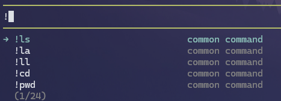
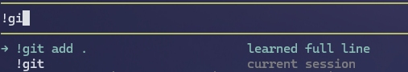

# pi-extension-bang-command-autocomplete

Autocomplete for `!<command>` in Pi.



Built-in suggestions for common shell commands appear as soon as you type `!`.



Learned full command lines and commands from the current session surface next to each other while you refine a bang.

## What it does

- Suggests command names while typing `!<command>`.
- Uses a built-in common-command index out of the box (with platform-aware defaults).
- Learns commands you run via `!`/`!!` and persists them across Pi sessions.
- Learns full bang command lines (e.g. `!git add .`) and suggests them directly.
- Learns flags used with those commands (e.g. `!rg -n`) and suggests them when you type `!<command> ` or `!<command> -...`.
- Also suggests learned command+flag combos directly while typing `!<command>`.
- Optionally adds commands from shell history for personalized suggestions.
- Keeps scope intentionally narrow (command + flag completion only; no positional-argument prediction).

## Install

```bash
pi install npm:@firstpick/pi-extension-bang-command-autocomplete
```

## Configuration

- `PI_BANG_AUTOCOMPLETE_INCLUDE_HISTORY`
  - `1|true|yes|on`: include commands from shell history.
    - Bash: `~/.bash_history`
    - Zsh: `~/.zsh_history`
    - Fish: `$XDG_DATA_HOME/fish/fish_history` (fallback: `~/.local/share/fish/fish_history`)
  - unset/other: use built-in command list only (default).
- `PI_BANG_AUTOCOMPLETE_RUNTIME_STORE_PATH`
  - optional absolute/relative file path for persisted learned commands.
  - default: `~/.pi/agent/state/bang-command-autocomplete-runtime.json`.
  - stores learned command names, learned full command lines, and per-command learned flags.

## Commands

- `/bang-refresh` — rebuild autocomplete index.
- `/bang-status` — show indexed command count, history-index status, runtime-learned command/line counts, and learned flag count.

## Tools

None.
