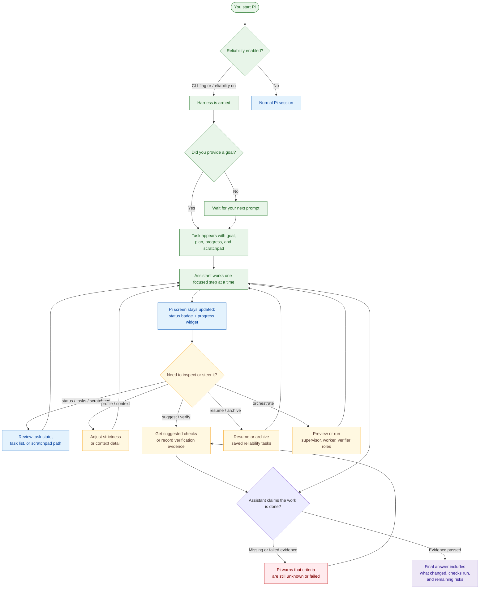
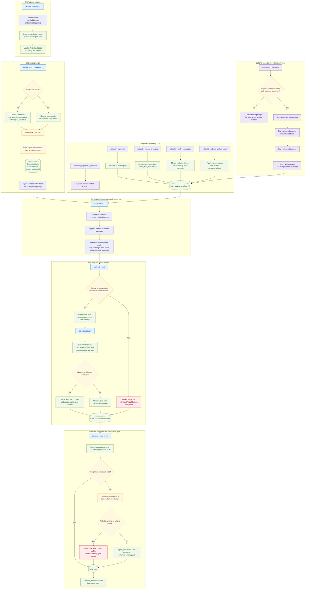

# @firstpick/pi-extension-reliability-harness

Small-LLM reliability layer for Pi. It keeps deterministic task state outside the model, injects a compact goal/plan reminder before every LLM call, blocks exact repeat loops, writes a scratchpad, and requires evidence-based verification before completion claims.

## Enable

```bash
pi -e ./pi-extension-reliability-harness/index.ts --reliability
```

Or inside Pi:

```text
/reliability on
/reliability on implement the checkout flow
/reliability status
/reliability verify
/reliability suggest
/reliability eval [--write]
/reliability tasks
/reliability tasks --all
/reliability resume <task_id_prefix>
/reliability archive <task_id_prefix>
/reliability profile strict|balanced|relaxed
/reliability context full|compact|delta
/reliability orchestrate [--run]
/reliability scratchpad
/reliability off
/reliability reset
```

The extension is opt-in by default. It stores task files under:

```text
.pi/tasks/{task_id}/state.json
.pi/tasks/{task_id}/scratchpad.md
.pi/tasks/{task_id}/state-events.jsonl
```

## Model-facing tools

- `reliability_status` — inspect current task state and scratchpad path.
- `reliability_set_plan` — replace or extend the current plan.
- `reliability_record_progress` — persist facts, decisions, errors, files, next action, and step status.
- `reliability_verify_completion` — record Passed/Failed/Unknown evidence for success criteria.
- `reliability_suggest_verification` — suggest verification commands from manifests (`package.json`, `Cargo.toml`, `pyproject.toml`, `go.mod`, etc.).
- `reliability_supervisor_decision` — inspect the deterministic supervisor-selected worker step.
- `reliability_submit_worker_result` — submit structured worker completion/block/fail output for the selected step.

## Workflow diagrams

These diagrams split the package into two views:

- **Frontend / user-facing flow** — what the Pi user sees and controls in the terminal UI. This package does not ship a separate browser frontend.
- **Backend / runtime flow** — how the extension stores state, intercepts Pi lifecycle events, supervises the assistant, and gates completion claims.

### Frontend / user-facing workflow



### Backend / runtime workflow



## Configuration

Optional project config:

```json
{
  "enabled": false,
  "profile": "balanced",
  "requirePlan": true,
  "requireVerification": true,
  "maxRepeatedAction": 3,
  "scratchpadEnabled": true,
  "contextBudgetChars": 6000,
  "contextMode": "compact",
  "progressWidget": true,
  "storeRawToolLogs": false,
  "rawLogMaxChars": 50000,
  "orchestrationMode": "prompt",
  "orchestrationModels": {
    "supervisor": "provider/model-id",
    "worker": "provider/model-id",
    "verifier": "provider/model-id"
  },
  "orchestrationTools": ["read", "grep", "find", "ls"],
  "orchestrationMaxOutputChars": 50000
}
```

Save it as `.pi/reliability.json` in a trusted project. `orchestrationMode` defaults to `prompt`; separate pi subprocesses only run when `orchestrationMode` is `separate-model` and `/reliability orchestrate --run` is invoked.

## What this MVP enforces

- Persistent JSON `TaskState` survives reload/resume.
- A deterministic initial plan exists for every active task.
- A compact reliability header is appended to every LLM context.
- Scratchpad is regenerated from state instead of letting the model grow it freely.
- Identical tool calls are blocked at the repeat threshold.
- Verification reports unknowns instead of inventing success.
- Verification suggestions detect common project test/check commands.
- Verification output parsers summarize common TypeScript, ESLint, Ruff, mypy, pytest, Cargo, Go test, JavaScript, Maven, and Gradle results.
- Strict/balanced/relaxed profiles tune repeat blocking, verification pressure, and default context mode.
- Context headers support `full`, `compact`, and `delta` modes to reduce repeated state injection.
- Optional raw tool log storage writes redacted/truncated logs under `.pi/tasks/{task_id}/tool-logs/` only when `storeRawToolLogs` is enabled.
- Strict profile queues a completion-gate follow-up if the assistant claims completion with failed/unknown criteria.
- Supervisor/worker split uses deterministic supervisor decisions plus `reliability_submit_worker_result` for structured worker completion/block/fail results.
- Optional separate-model orchestration can run supervisor, worker, and verifier roles as separate `pi --mode json --no-session` subprocesses.
- Offline reliability evaluation reports deterministic harness metrics with `/reliability eval [--write]`.
- Task list/resume/archive/eval UX is available from `/reliability` commands.

## Development

Source layout:

```text
index.ts                        # Pi extension registration, commands, tools, event wiring
src/core.ts                     # Compatibility re-export facade
src/completion-gate.ts          # Completion-claim detection and strict follow-up prompt
src/config.ts                   # Config/profile/context/orchestration normalization
src/context-builder.ts          # Full/compact/delta reliability context headers
src/evaluation.ts               # Offline deterministic reliability evaluation metrics
src/loop-detector.ts            # Repeated-tool-call loop detection
src/orchestration.ts            # Separate-model role prompts, subprocess runner, and result parsing
src/paths.ts                    # Task-local path helpers
src/planner.ts                  # Goal extraction, default plan, and step transitions
src/progress-ui.ts              # Status text and widget updates
src/redaction.ts                # Secret redaction and raw-log truncation helpers
src/scratchpad.ts               # Scratchpad rendering
src/supervisor.ts               # Deterministic supervisor decision and worker-result contract
src/task-state.ts               # Persistent task state and task list/resume/archive helpers
src/tool-normalizer.ts          # Tool path extraction, summaries, and optional raw-log writes
src/types.ts                    # Shared task/config/result types and constants
src/utils.ts                    # Shared JSON, time, text, hashing, and content helpers
src/verification-state.ts       # Verification records and completion marking
src/verifier.ts                 # Verification command output parsers
src/verification-suggestions.ts # Project manifest verification command suggestions
tests/                          # Node test runner mocks for Pi lifecycle events
```

```bash
npm test
npm pack --dry-run --json
```

The test suite mocks Pi extension lifecycle events and covers task creation, context injection, context modes, profile behavior, supervisor/worker contracts, orchestration dry-runs/parsers, offline evaluation metrics, completion gating, loop blocking, redacted raw-log storage, verification suggestions, parsed verification results/failures, and task list/resume/archive commands.

## Current limits

- `/reliability eval` is an offline deterministic harness evaluation; live small-model completion-rate evaluation still requires running representative tasks with actual configured models.
- Separate supervisor/worker/verifier subprocesses are explicit and opt-in; prompt-contract mode remains the default.
- It does not rewrite or compress normal conversation history yet.
- Raw tool logs are intentionally not stored by default to avoid persisting secrets; normalized summaries are stored in state.
