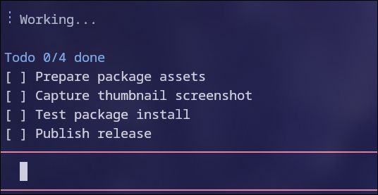

# @firstpick/pi-extension-todo-progress

Auto todo/progress tracking for multi-goal prompts.



## What it does

- Instructs the agent to create concise, agent-authored todos for multi-step work.
- Tracks checklist markers from assistant messages instead of copying raw user prompt lines.
- Instructs the agent to emit markdown checklist lines exactly like `- [ ] item`, `- [-] item`, or `- [x] item`.
- Also accepts bare markers like `[ ] item` as a fallback for robustness.
- Strips matched checklist lines from assistant messages after mirroring them into the widget, keeping the widget as the canonical todo view.
- Clears the widget automatically when all items are complete.
- Shows up to 5 rows.
- Supports hiding the current list manually.

## Install

```bash
pi install npm:@firstpick/pi-extension-todo-progress
```

## Configuration

No required configuration.

## Commands

None.

## Shortcuts

- `Ctrl+Alt+X` — hide current list.
- `Ctrl+Alt+J` / `Ctrl+Alt+K` — scroll todo list down/up.

## Tools

None.

## Example view

```text
Todo 1/3 done, 1 partial
[x] Inspect package structure
[-] Update README examples
[ ] Run readiness checks
```

For multi-step requests, Pi keeps a compact progress widget visible and updates it as work moves from planned to in-progress to done.
