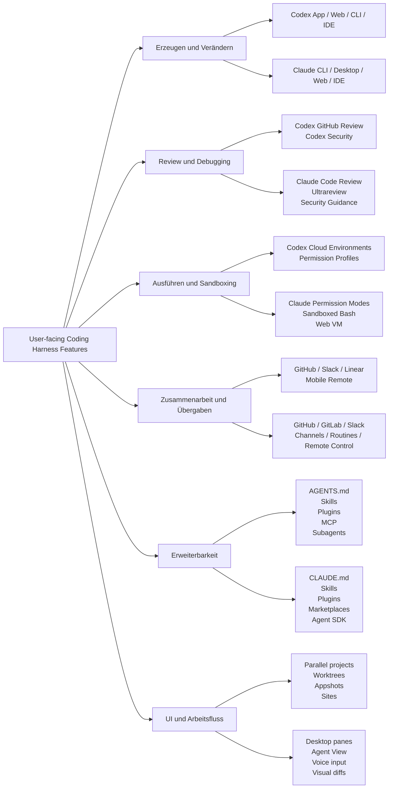
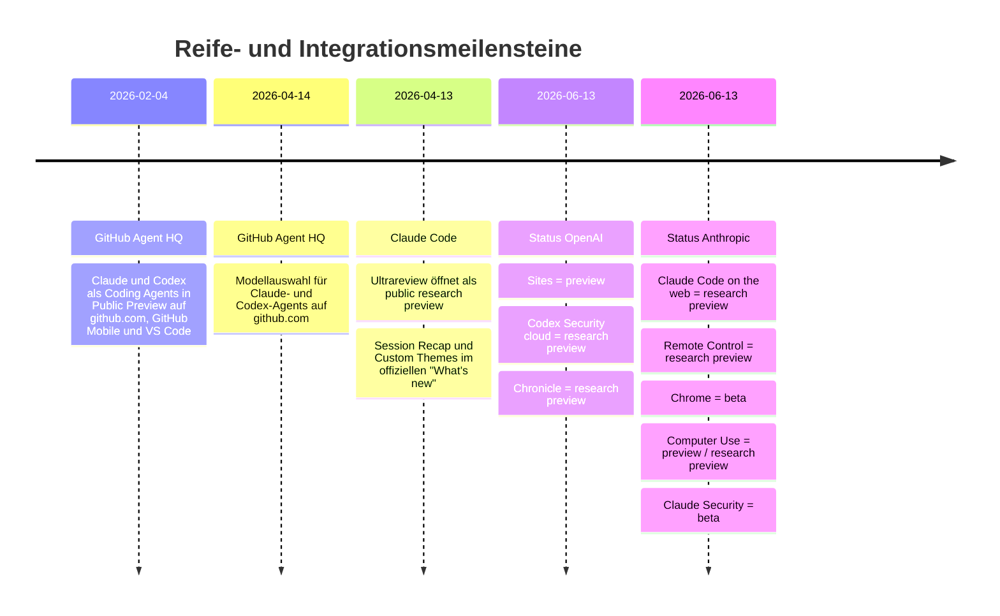

# Tiefenrecherche zu den nutzerseitigen Features von OpenAI Codex und Anthropic Claude Code

## Executive Summary

OpenAI Codex und Anthropic Claude Code sind im Stand vom 13. Juni 2026 beide keine „einzelnen Autocomplete-Tools“ mehr, sondern vollständige agentische Coding-Harnesses mit mehreren Oberflächen: lokale Shell/CLI, Editor-Integrationen, Cloud-Sessions, CI/CD-Einbindung, Extensibilitätsmechanismen und Organisationskontrollen. Der zentrale Unterschied liegt weniger in der Grundidee als in der Produktgestalt. OpenAI positioniert Codex stark um das ChatGPT/Codex-Ökosystem herum: Desktop-App, Codex Web mit GitHub-gebundenen Cloud-Tasks, Slack- und Linear-Anbindung, Plugin-/Skill-System, Sites-Hosting und eine zweistufige Security-Story mit lokalem Security-Plugin plus separatem Cloud-Scanner. Anthropic positioniert Claude Code stärker als terminal-first Entwicklungsumgebung, erweitert um Web, Desktop, Remote Control, Routines, Channels, CI/CD-Pipelines, Agent SDK und eine sehr detailliert dokumentierte Sicherheits- und Berechtigungsoberfläche. citeturn24search13turn11search0turn26view0turn26view1turn26view7

Für reine Entwickler-Workflows ist Anthropic derzeit dokumentationsseitig klarer in Bereichen wie Rechte-Modi, Sandboxing-Optionen, Hintergrundsitzungen, geplanten Tasks, Event-getriebener Orchestrierung und Editor-nahen UX-Hilfen. Claude Code dokumentiert etwa explizit `default`-, `acceptEdits`-, `plan`-, `auto`-, `dontAsk`- und `bypassPermissions`-Modi, mehrere Isolationsstrategien vom eingebauten Bash-Sandboxing bis zur kompletten VM/Web-Umgebung, sowie Bedienhilfen wie Voice Dictation, Transcript Viewer, Session Recap, Themes, Vim-Mode und Agent View. OpenAI dokumentiert zwar ebenfalls starke Sicherheits- und Automationsfunktionen, aber viel davon ist stärker um Konfigurationsdateien, Cloud-Umgebungen, GitHub-Delegation, Worktrees, Skills/MCP und Governance strukturiert als um ein fein granuliertes lokales Bedienmodell. citeturn27view4turn27view2turn27view3turn27view5turn26view4turn11search1turn11search3turn15search4turn32view6turn32view4

OpenAI ist dafür breiter bei „adjazenten“ Produktflächen im Codex-Ökosystem: Die Desktop-App ist auf parallele Projekt-/Thread-Arbeit ausgelegt, Codex Web delegiert GitHub-Aufgaben in isolierte Cloud-Container, Plugins bündeln Skills, App-Integrationen und MCP-Server, Sites kann gehostete Websites/Web-Apps/Games direkt deployen, und Codex Security existiert sowohl als installierbares Plugin im Thread als auch als separater Cloud-Scanner für verbundene GitHub-Repositories. Außerdem bietet OpenAI lokal und in der Cloud getrennte Authentifizierungs- und Datenhandhabungsmodelle über ChatGPT-Login, API-Key und Enterprise-Access-Tokens. citeturn24search13turn11search0turn11search1turn15search0turn15search1turn24search18turn10search6turn25search2

Bei Preisen und Limits ist OpenAI derzeit stärker plan- und credits-getrieben innerhalb des ChatGPT-Ökosystems, mit klaren Unterschieden zwischen Free/Go/Plus/Pro/Business/Enterprise sowie API-Key-Nutzung; viele Cloud-Funktionen entfallen beim reinen API-Key-Zugang. Anthropic koppelt Claude Code in den individuellen Plänen an Pro/Max und in den Orga-Plänen an Team/Enterprise; zusätzlich existieren Usage Credits, API-Tiers und – wichtig für die zeitliche Einordnung – eine bereits angekündigte, aber am 13. Juni 2026 noch nicht wirksame Umstellung der Agent-SDK- und `claude -p`-Abrechnung ab dem 15. Juni 2026. citeturn13view0turn13view2turn13view3turn25search2turn28view2turn28view3turn28view4turn20search0

## Methode und Abgrenzung

Diese Auswertung betrachtet ausschließlich **nutzerseitig sichtbare Features** in den öffentlichen Produktdokumentationen, Pricing-Seiten, offiziellen Repositories und offiziellen/nahen Changelogs. Als „Feature“ zähle ich daher Oberflächen, Befehle, Workflows, Integrationen, Extensibilitätsmechanismen und Governance-/Sicherheitsfunktionen, die ein Endnutzer, Team-Admin oder Integrator bewusst auslösen, konfigurieren oder beobachten kann. **Nicht** aufgenommen wurden interne Agentenarchitekturen, nicht freigegebene Leaks, implizite Modellfähigkeiten ohne Produktoberfläche und nicht dokumentierte UI-Details. Wo die Quellen eine Eigenschaft nicht explizit nennen, ist sie als **„unspecified“** markiert. citeturn14view0turn14view1turn26view0turn9search5

Für OpenAI habe ich mich auf die offizielle Codex-Dokumentation zu App, Web, CLI, IDE, SDK, Security, Integrationen, Policies und Pricing gestützt; für Anthropic auf die Claude-Code-Dokumentation zu CLI, Desktop, Web, Remote Control, IDEs, Plugins, Skills, Code Review, CI/CD, Sandboxing, Costs und Agent SDK sowie auf die offiziellen Pricing-/Support-Seiten. Ergänzend wurden offizielle GitHub-Changelogs und offizielle GitHub-/Repository-Ressourcen für Drittökosysteme und Demo-Oberflächen berücksichtigt. citeturn14view0turn13view4turn26view0turn26view7turn21view2turn17search0turn17search1

Wichtig für die Interpretation: Beide Produkte dokumentieren heute **agentische Session-Harnesses**, nicht primär klassische „inline code completion“-Produkte. Eine dedizierte Playground-Oberfläche speziell für Codex bzw. Claude Code ist in den hier ausgewerteten Produktmenüs nicht als eigener Surface-Typ ausgewiesen; die zentralen produktiven Flächen sind App/Desktop, CLI, IDE, Web, CI/CD, SDK und Integrationen. Inline-Autocompletion im Sinne klassischer Copilot-Toolbar-Completion ist in den aktuellen produktbezogenen Docs beider Harnesses nicht als Kernfeature prominent dokumentiert und wird deshalb als **unspecified** behandelt. citeturn14view0turn26view0turn27view0

## OpenAI Codex

OpenAI Codex ist am klarsten als **mehrflächiges Coding-Agent-System** dokumentiert: Codex App für lokale Desktop-Arbeit, Codex Web für Cloud-Tasks gegen GitHub-Repositories, Codex CLI für interaktive oder nicht-interaktive lokale Nutzung, eine IDE-Extension, programmatic control über SDKs/App-Server/GitHub Action sowie ein Erweiterungsmodell über AGENTS.md, Skills, Plugins, MCP, Hooks und Subagents. Dazu kommen Kollaborationsflächen wie GitHub-Reviews, Slack und Linear, sowie Security/Enterprise-Funktionen wie Permission Profiles, Rules, Internet-Kontrollen, Access Tokens, Analytics API und Compliance API. citeturn24search13turn11search0turn15search4turn10search5turn10search4turn15search3turn32view3turn32view5turn32view6turn32view4turn30search0turn30search1

### Featureinventar von OpenAI Codex

| Feature | Funktion | Kurzbeschreibung | Typischer Workflow | Ein-/Ausgabe | Sprachen & Laufzeiten | Anpassung | Fehlerbehandlung / Feedback | Security / Privacy / Preis / Reife |
|---|---|---|---|---|---|---|---|---|
| **Codex App** | Code-Generierung, Refactor, Debugging, Versioning, UI/UX | Desktop-„Command Center“ für parallele Threads/Projekte mit eingebauter Worktree- und Git-Unterstützung. | Projektordner öffnen → Thread starten → Codex arbeitet lokal im Projekt bzw. Worktree → Diff/Review im App-Kontext prüfen. | Text, Code, lokale Dateien; weitere Modalitäten je nach aktivierten Zusatzfeatures. | App laut Docs auf **macOS und Windows**; Linux in den ausgewerteten Quellen noch nicht als verfügbare App ausgewiesen. Programmiersprachen: **unspecified**. | Projekte, Threads, Worktrees, Einstellungen; AGENTS.md/Skills/Plugins/MCP können den lokalen Lauf prägen. | Thread-/Projektverwaltung, Pin/Archivierung; Troubleshooting für fehlende Threads/Archiv-Filter ist dokumentiert. | In ChatGPT Plus/Pro/Business/Edu/Enterprise enthalten; API-Key-Nutzung möglich, aber mit Funktionslücken. Reife: **unspecified**. citeturn24search13turn34view0turn34view1turn30search5turn25search0turn13view1 |
| **Codex Web** | Background coding, Code-Generierung, Debugging, Cloud-Execution, Collaboration | Cloud-Agent, der GitHub-Repositories in isolierten Containern auscheckt, Setup-Skripte ausführt, Code ändert und PR-fähige Diffs erzeugt. | GitHub verbinden → Environment wählen/konfigurieren → Task starten → Container baut Repo-Umgebung → Agent arbeitet → Diff prüfen → PR öffnen oder Follow-up senden. | Textprompts, Repository-Code, Dateien in GitHub-Repos. Voice: **unspecified**. | Cloud-Container; Sprache des Repos im Produkttext nicht eingeschränkt, aber offiziell **unspecified**. | Umgebungen, Setup-/Maintenance-Skripte, AGENTS.md, Internet-Policy pro Environment. | Ergebnis + Diff nach Lauf; GitHub-Delegation und Follow-ups möglich. | Agent-Internet ist standardmäßig **aus**; Setup-Skripte dürfen online sein; Domain-Allowlist/HTTP-Methoden konfigurierbar. In Plus/Pro/Business/Edu/Enterprise enthalten. Reife: **unspecified**. citeturn11search0turn11search1turn11search2turn13view4 |
| **Codex CLI im interaktiven Modus** | Code-Generierung, Erklärung, lokales Review, Debugging, Execution | Terminal-Oberfläche für lokale agentische Arbeit. | `codex` starten → Aufgabe beschreiben → Slash-Commands wie `/status` oder `/review` nutzen → Änderungen lokal prüfen. | Text, Code, lokale Dateien; Bilder je nach Skill/SDK-Kontext. | Lokale Laufzeit; unterstützte Code-Sprachen **unspecified**. | Config-Dateien, AGENTS.md, MCP, Hooks, Permission Policies, Sandbox-Optionen. | `/status` zeigt Modell, Approval Policy, Writable Roots und Token-Nutzung; `/debug-config` zeigt aktive Konfigurationsschichten. | Sign-in via ChatGPT oder API-Key; Datenhandhabung folgt je nach Auth dem ChatGPT-Workspace oder der API-Organisation. Reife: **unspecified**. citeturn25search1turn25search2turn24search6 |
| **`codex exec` und scriptbare CLI-Automation** | CI/CD, Batch-Verarbeitung, strukturierte Ausgabe, Telemetrie | Nicht-interaktiver Modus für Scripts und CI; streamt Fortschritt und kann JSONL-Events ausgeben. | `codex exec "<task>"` → Fortschritt auf `stderr`, Finale Antwort auf `stdout`; optional JSONL für Maschinenkonsum, Pipelines und Redirects. | Text, Standard Input, maschinenlesbare Event-Streams; Code/Dateien aus Workspace. | Lokale Laufzeit. Sprachen: **unspecified**; ideal für Shell-/CI-Umgebungen. | Sandbox-Flags, `--json`, `--ephemeral`, `--ignore-user-config`, `--ignore-rules`. | JSONL-Events enthalten u. a. `turn.completed`, `turn.failed`, `item.*`, `error`; `required`-MCP-Server führen bei Init-Fehler zum Exit. | Default read-only sandbox; `workspace-write` und `danger-full-access` explizit; GitHub Action baut darauf auf. Preis je nach Plan oder API-Key; Reife des Modus in Quellen **unspecified**. citeturn32view7turn10search4 |
| **IDE Extension** | Code-Generierung, Edit-in-editor, Refactor, Image-Generation, Editor-Integration | Editor-nahe Oberfläche für Codex; offizielle Quellen nennen Codex in IDE sowie Installationspfade u. a. für VS Code, Cursor und Windsurf. | Extension installieren → im Editor agentische Aufgabe starten → Codex arbeitet auf Repo-Kontext → Diff lokal anwenden. | Text, Code, Repo-Dateien; **Bildgenerierung/-bearbeitung** ist im IDE-Feature-Guide explizit dokumentiert. | Offiziell genannte Editoren in OpenAI-Repo: VS Code, Cursor, Windsurf; Node-/Python-Runtime für SDK separat. Programmiersprachen: **unspecified**. | IDE-Settings, Slash-Commands, AGENTS.md, MCP, Skills. | Ausgewertete IDE-Dokumentation ist im Vergleich zu Anthropic dünner; konkrete Fehleroberflächen im Editor bleiben in den hier genutzten Quellen teilweise **unspecified**. | In Plus/Pro/Business/Enterprise enthalten; per API-Key nutzbar, aber ohne Cloud-Features. Reife: **unspecified**. citeturn13view4turn16search3turn34view8 |
| **Codex SDKs und App-Server** | API/SDK, Extensibility, eigene Apps/Agents | Programmatic control lokaler Codex-Agents per TypeScript/Node und Python; Threads, Streaming, Structured Output, Bild-Inputs, Arbeitsverzeichnisse. | SDK installieren → Thread starten/resumieren → Prompt senden → Events oder strukturierte Antworten verarbeiten → eigene App/Workflow bauen. | Text, strukturierte JSON-Schemas, lokale Bilder, Event-Streams. | TypeScript-SDK: **Node 18+**; Python-SDK: **Python 3.10+**; Python-SDK ist laut Docs **beta**. | `outputSchema`, `env`, `workingDirectory`, `skipGitRepoCheck`, Sandbox-Presets; Python asynchron via `AsyncCodex`. | Streaming- und Event-basierte Verarbeitung; Resume per Thread-ID. | SDK zielt auf lokale Agents; Auth und Datenpolitik hängen am verwendeten Codex-Login. Preis/Limits folgen Plan oder API. TypeScript-Reife: **unspecified**; Python: **beta**. citeturn23view1turn23view3turn21view3 |
| **AGENTS.md, Skills, Plugins, MCP, Subagents, Hooks** | Customization, Extensibility, Plugins, Multi-Agent | OpenAIs Erweiterungsstack: AGENTS.md für Anweisungen, Skills für wiederverwendbare Workflows, Plugins als Paket aus Skills/Apps/MCP, MCP für externe Tools/Dokumentation, Subagents für Parallelarbeit, Hooks für deterministische Lifecycle-Skripte. | Repo/Global-`AGENTS.md` anlegen → Skills/Plugins/MCP konfigurieren → bei komplexen Aufgaben Subagents nutzen → Hooks für Logging/Validierung/Prompt-Guardrails einschalten. | Text, Code, Dateien; je nach Plugin/App/MCP auch Dritttool-Daten. | MCP wird in **CLI und IDE** unterstützt; weitere Programmiersprachen **unspecified**. | Layered instructions, Skill-Skripte, Plugin-Installationen, MCP-Server, Custom Agents, Hook-Skripte. | Hooks können Logging/Analytics, Secret-Scanning, Validation u. a. ausführen; Plugin-Installationen verlangen teils App-Auth. | Rules sind **experimental**, Permission Profiles **beta**; Skills/Subagents/Plugins/MCP selbst in den zitierten Seiten ohne einheitliches Reife-Label. citeturn15search3turn32view3turn32view5turn32view6turn32view4turn30search9turn11search3turn11search4 |
| **GitHub, Slack und Linear** | Collaboration, CI/CD, Review, Issue-to-Code | Codex integriert sich direkt in GitHub PRs/Issues sowie in Slack und Linear. | In GitHub `@codex review` oder `@codex <task>` posten; in Slack `@Codex` mentionen; in Linear Issue an Codex zuweisen oder `@Codex` im Thread erwähnen. | Text, PR-/Issue-Kontext, Repo-Diffs; Ausgaben als Reviews, Kommentare, Fortschrittsupdates, Fix-Branches. | GitHub-/Slack-/Linear-Oberflächen; Laufzeiten **unspecified**. | Review-Guidance via `AGENTS.md`; One-off-Fokus im PR-Kommentar; Workspace-/Connector-Setups. | GitHub-Troubleshooting ist dokumentiert; Reviews fokussieren P0/P1 in GitHub; Linear weist auf mögliche Modellfehler und Review-Bedarf hin. | Slack/Linear sind an bezahlte Pläne gekoppelt; API-Key hat **keine** Cloud-Features wie GitHub Review/Slack. Reife: **unspecified**. citeturn10search0turn10search1turn10search2turn24search11turn25search2 |
| **Security-Familie: Permission Profiles, Rules, Internet Controls, Enterprise Governance** | Security, Privacy, Telemetry, Enterprise | Least-Privilege-Steuerung für lokale Kommandos, experimentelle unsandboxed-Regeln, Cloud-Internet-Allowlisting, Analytics/Compliance/Audit. | Permission Profile wählen → ggf. org-weit per `requirements.toml` beschränken → Cloud-Internet pro Environment erlauben/verbieten → Analytics/Compliance-APIs für Monitoring anbinden. | Keine neue Nutzermodalität; betrifft Laufverhalten und Governance. | Lokale Permission Profiles laut Docs auf macOS, Linux, WSL und nativem Windows unterstützt; Cloud-Internet in Web-Umgebungen. | `default_permissions`, benutzerdefinierte Profile, org-managed allowlists, Domain-Allowlists, Analytics-API. | Analytics-Export als CSV/JSON; Code-Review-Metriken und 90-Tage-Rückblick in der Analytics API. | Enterprise: keine Nutzung von Enterprise-Daten zum Training, Zero Data Retention für App/CLI/IDE, Residency/Retention gemäß ChatGPT Enterprise, Audit via Compliance API. Permission Profiles **beta**, Rules **experimental**. citeturn11search3turn11search2turn30search0turn30search1turn14view1 |
| **Remote, Mobile, SSH, Appshots, Memories, Chronicle** | Remote Control, Context Capture, Mobility, UI/UX | Remote-Verbindungen auf Host/SSH-Basis, mobile Steuerung über ChatGPT, Mac-Appshots und Erinnerungsfunktionen. | Host in Codex App verbinden → per QR mit ChatGPT Mobile koppeln → Tasks unterwegs steuern; optional Appshots an Thread senden; Memories aktivieren; auf macOS optional Chronicle. | Text, Code, Dateien, Screenshots/Fensterkontext; mobile Remote Control über iOS/Android/ChatGPT. | Mobile Remote: iOS/Android mit ChatGPT; App-Host macOS/Windows; SSH-Remote für entfernte Projekte. Appshots und Chronicle: **macOS**. | QR-Pairing, SSH-Konfiguration, Memory-Flags in Settings/`config.toml`. | Remote zeigt Outputs, Diffs, Testresultate und Screenshots; Host-Einschränkungen für Windows im Mobile-Setup sind dokumentiert. | Chronicle ist **opt-in research preview**, verlangt Screen Recording/Accessibility und speichert Erinnerungen unverschlüsselt lokal; Memories redigieren Secrets. Reife sonst oft **unspecified**. citeturn32view8turn32view9turn32view10turn32view2turn32view0turn32view1 |
| **Sites** | Deployment, Example App / App-Hosting, Frontend-Generierung | Sites baut und deployt gehostete Websites, Web-Apps und Games direkt aus Codex heraus. | Sites-Plugin hinzufügen → Aufgabe beschreiben oder `@Sites` erwähnen → Build validieren → Version speichern oder deployen. | Text, Projektdateien; Web-Outputs/Deployments. | Zieloberfläche Web; Programmiersprachen/Runtimes des Inhalts **unspecified**. | Prompting, Plugin-Aufruf, Version vor Deploy speichern. | Review vor Livegang ist empfohlen; jede Deployment-URL ist produktiv. | Verfügbar in **preview** für Business und Enterprise; Enterprise benötigt RBAC-Freischaltung. citeturn15search1 |
| **Codex Security Plugin und Codex Security Cloud** | Security Review, Vulnerability Scanning, Remediation | Lokales Security-Plugin für genehmigte Repos/Diffs plus separater Cloud-Scanner für verbundene GitHub-Repositories. | Plugin über `/plugins` installieren → neuen Thread im autorisierten Repo starten → Scan-/Deep-Scan-Workflows oder Diff-Review nutzen; alternativ Cloud-Scan im Web anlegen. | Text, Code, Repos, Markdown/HTML-Reports. | Reposprachen **unspecified**; Cloud arbeitet gegen verbundene GitHub-Repos. | Threat Model/Project Overview kann priorisieren und Ergebnisse verbessern. | Auto-Validation in sauberem Container reduziert False Positives; Reports und Patch-Vorschläge sind reviewbar. | Security Cloud ist **research preview**; Plugin-Reife in den ausgewerteten Quellen **unspecified**; Zugriff je nach Plan/Workspace. citeturn10search3turn10search6turn10search7turn10search8turn10search9 |

### Einordnung zu OpenAI

OpenAI Codex ist funktional besonders stark in vier Achsen: **ChatGPT-nahe Cloud-Delegation**, **lokal/remote kombinierte Entwicklungsarbeit**, **Plugins/MCP/Skills als zusammensetzbarer Erweiterungsstack** und **organisationsweite Governance**. Auffällig ist, dass OpenAI fast alle großen Oberflächen – App, Web, CLI, IDE, SDK und GitHub Action – in einer zusammenhängenden Produktfamilie abbildet und mit demselben Konfigurations- und Sicherheitsmodell verbindet. citeturn13view4turn10search5turn10search4turn32view6turn30search1

Gleichzeitig sind einige Details im Vergleich zu Claude Code weniger explizit dokumentiert. Dazu zählen in den hier geprüften Quellen unter anderem editornahe UX-Hilfen der IDE-Extension, konkrete Inline-Completion-Mechaniken, sowie detaillierte Fehler-/Warnoberflächen in der IDE. Diese Punkte sind daher nicht als fehlend, sondern als **unspecified in den ausgewerteten Quellen** zu lesen. citeturn13view4turn14view0

## Anthropic Claude Code

Anthropic Claude Code ist in den aktuellen Quellen das **am feinsten dokumentierte agentische Coding-Environment** auf Anwenderseite. Die Produktfamilie umfasst CLI, Web, Desktop, Remote Control, VS Code, JetBrains, Chrome-Beta, Computer-Use-Preview, GitHub Code Review, GitHub Actions, GitLab CI/CD, Slack, Routines, Scheduled Tasks, Channels, Agent View, Plugins, Skills, Plugin-Marketplaces, Security Guidance und das Claude Agent SDK mit offiziellen Demo-Apps. Anthropic beschreibt dabei nicht nur die Features, sondern auch die Bedienmodi, Sicherheitsgrenzen, Kostenhebel und Übergänge zwischen lokalen und Cloud-Sessions bemerkenswert detailliert. citeturn26view0turn26view1turn26view3turn26view13turn26view14turn26view15turn26view16turn33view8turn8view6turn26view12turn26view18turn26view19turn26view8turn16view7turn21view2

### Featureinventar von Anthropic Claude Code

| Feature | Funktion | Kurzbeschreibung | Typischer Workflow | Ein-/Ausgabe | Sprachen & Laufzeiten | Anpassung | Fehlerbehandlung / Feedback | Security / Privacy / Preis / Reife |
|---|---|---|---|---|---|---|---|---|
| **CLI im interaktiven Modus** | Code-Generierung, Refactor, Debugging, Review, UI/UX | Terminal-Primärfläche mit Commands, plan mode, model/effort-Wechseln, Hintergrund-Subagents, Task-Listen, Session Recap, Voice Dictation, Vim-Mode und Transcript Viewer. | `claude` starten → Aufgabe eingeben → `/plan`, `/model`, `/permissions`, `/background`, `/tasks` usw. nutzen → parallel laufende Arbeit verfolgen. | Text, Code, Shell, lokale Dateien; **Voice Dictation** ist dokumentiert. | Claude kann laut Produktdoku **Code in jeder Sprache lesen**; CLI-Sandbox läuft auf macOS, Linux, WSL2; natives Windows für das eingebaute Bash-Sandboxing nicht unterstützt. | `/config`, `.claude/`, `CLAUDE.md`, Skills, Plugins, Agents, Permissions. | Reiche Bedienrückmeldungen via Command-UI, Task-Liste, Transcript Viewer, Session Recap; Tastaturkürzel und Interrupts dokumentiert. | Permission Modes und Sandboxing fein steuerbar. Preis/Limits folgen Plan/API. Reife der CLI insgesamt **unspecified**. citeturn27view0turn27view5turn9search17turn27view2 |
| **Claude Code on the Web** | Background coding, Cloud execution, Collaboration | Cloud-Sessions auf Anthropic-Infrastruktur, persistent über Browser-Schließen hinaus, mit GitHub-Repo-Klon in isolierter VM und Branch-Push zur Review. | GitHub verbinden → Task auf `claude.ai/code` oder mobil starten → Claude klont Repo in isolierte VM → Änderungen auf Branch pushen → Review/PR. | Text, Code, GitHub-Repositories; Monitoring über mobile App. | Cloud-VM; GitHub-Repo erforderlich. Sprachen: da Claude Code Code in jeder Sprache lesen kann, formal nicht beschränkt; Laufzeitdetails pro Sprache **unspecified**. | Cloud-Environments, Setup-Skripte, Netzwerkzugang, Docker; Sessions mit `--remote`/`--teleport` zwischen Web und Terminal bewegen. | Persistente Sessions; Web- und Quickstart-Doku erklären Review-Punkte und PR-Zielpfad. | **Research preview**; verfügbar für Pro, Max, Team und bestimmte Enterprise-Sitztypen. citeturn26view1turn26view2turn26view14 |
| **Desktop Application** | Parallelarbeit, UI/UX, Diff-Review, Native/GUI-Workflows | Visuelle Desktop-Oberfläche mit parallelen Sessions, Git-Isolation, Drag-and-drop-Pane-Layout, integriertem Terminal und File Editor, Side Chats, Computer Use, Visual Diff Review, App Previews, PR Monitoring und Connectors. | Desktop öffnen → Session(s) nebeneinander anordnen → lokal arbeiten oder in Cloud/IDE dispatchen → Diffs visuell prüfen. | Text, Code, Dateien; GUI-nahe Vorschauen und visuelle Diffs. | Desktop-OS in den zitierten Seiten nicht explizit genannt; **unspecified**. | Pane-Layout, Connectors, Enterprise-Konfiguration, Scheduled Tasks/Routines im selben App-Kontext. | Visuelle Sessionverwaltung; klare Entscheidungshilfe Desktop vs CLI dokumentiert. | Reife: **unspecified**. Preis je nach Claude-Plan. citeturn33view0turn26view3 |
| **Remote Control** | Mobility, Remote Session Continuation, Approval UX | Web-/Mobile-Fenster auf eine lokal weiterlaufende Claude-Code-Session; nichts wandert in die Cloud. | Auf Maschine Remote Control starten → Session-URL oder QR-Code öffnen → Session am Handy oder Browser fortsetzen → lokal laufende Arbeit steuern. | Text, Code, Dateien; Zugriff via Browser sowie Claude-App für iOS/Android. | Session läuft auf lokaler Maschine; Frontends über Browser und mobile Apps. | Session-Namen, Zugriff in Admin Settings auf Team/Enterprise. | Remote-Sessions erscheinen mit Online-Status; Öffnung per URL, QR oder Sessionliste. | **Research preview**; auf Team/Enterprise standardmäßig aus, bis Admin es aktiviert. citeturn26view13 |
| **VS Code und JetBrains** | Editor-Integration, Diff-Review, Context Sharing | Offizielle Editor-Plugins; JetBrains nennt explizit interaktives Diff-Viewing, Selection Context Sharing und Quick Launch; VS Code kann Cloud-Sessions aus `claude.ai` wieder aufnehmen. | Plugin installieren → Claude Code aus Editor starten → aktuelle Datei/Selection teilen → Session lokal oder remote fortsetzen → Diff im Editor prüfen. | Text, Code, Dateiauswahl; editorinterne Diffs. | JetBrains: IntelliJ IDEA, PyCharm, Android Studio, WebStorm, PhpStorm, GoLand; VS Code separat. Programmiersprachen: editorabhängig, Claude-seitig sprachagnostisch. | Editor-Settings, Session History, Local/Remote Tabs. | JetBrains respektiert Read-Deny-Rules beim Selection Sharing; VS Code zeigt Session-History-Dialog. | Reife: **unspecified**. Inline-Autocompletion als Claude-Code-Feature: **unspecified**. citeturn26view14turn33view4 |
| **Chrome Extension und Computer Use** | Browser-Automation, GUI-Testing, Debugging | Chrome-Integration für Testing, Form Filling, Datenextraktion; Computer Use für App-/Desktop-Steuerung am Bildschirm. | Chrome verbinden → Web-App testen / Logs lesen / Formulare füllen; oder Computer Use in CLI/Desktop aktivieren → Claude klickt, tippt, screent. | Text, Code, Web-Inhalte, Screenshots/Screen-Control. | Chrome Extension: Browser; Computer Use laut zitierter CLI-Doku auf **macOS**, Pro/Max, interaktive Session. | Site-Permissions, App-Approvals pro Session. | Troubleshooting für Extension-Erkennung, Browser-Responsiveness und Computer-Use-Konflikte ist dokumentiert; jederzeit stoppbar. | Chrome ist **beta**; Computer Use ist **preview / research preview** und in der zitierten CLI-Doku nicht für Team/Enterprise verfügbar. citeturn26view16turn33view8 |
| **Background-Orchestrierung: Agent View, Routines, Scheduled Tasks, Channels** | Always-on work, Scheduling, Event-driven automation, Collaboration | Agent View verwaltet viele laufende Sessions; Routines wiederholen Cloud-Prompts; Desktop Scheduled Tasks laufen lokal; Channels pushen Events/Webhooks in laufende Sitzungen. | Session in Hintergrund schicken → in Agent View Needs input/Working/Completed verfolgen; Routine oder lokalen Task planen; CI/Chat/Monitoring per Channel ins laufende Gespräch pushen. | Text, Code, Webhooks, CI-Events, Chat-Nachrichten. | Routines laufen cloudbasiert, Desktop Scheduled Tasks lokal; Channels basieren auf MCP-Servern. | Intervalle, Prompt-Vorlagen, Channel-Konfiguration, Remote vs Local Routine-Ziel. | Agent View gruppiert Statuszustände; Channels können zweiwegig sein; Scheduled Tasks verweisen auf Channels bei Event- statt Polling-Bedarf. | Reife: überwiegend **unspecified**, aber Web-nahe Background-Workflows klar dokumentiert. citeturn26view4turn26view5turn26view6turn26view18turn33view9turn33view10 |
| **Code Review und Ultrareview** | Review, Static-like analysis, Collaboration, GitHub | Managed GitHub-PR-Review mit Inline-Kommentaren, Severity-Tags und Check Run; lokaler Diff-Review per `/code-review`; zusätzlich `ultrareview` als starkes Remote-Review im Preview. | PR öffnen → automatische oder manuelle Review; Findings im Check Run/Kommentare prüfen; lokal `/code-review` oder `/code-review ultra` ausführen. | PR-Diffs, Repo-Kontext, Review-Kommentare. | GitHub / lokales Repo; GHES-Unterstützung auf Team/Enterprise. | Tuning via `CLAUDE.md` oder `REVIEW.md`; lokaler Review-Befehl. | Findings sind nach Severity markiert; ultrareview zeigt vorab Scope, freie Runs und Kostenschätzung; Fehlläufe/Missing Comments werden dokumentiert. | Code Review-Reife in Docs **unspecified**; **ultrareview = public research preview**. Pricing für einzelne Reviews in ausgewerteten Quellen teilweise **unspecified**. citeturn33view7turn8view7turn8view11 |
| **GitHub Actions und GitLab CI/CD** | CI/CD, Issue-to-Code, Automation, MR/PR flow | Claude Code in eigener CI-Infrastruktur ausführen; auf GitLab in isolierten Jobs, mit MR-Erstellung und Provider-Abstraktion. | Event/Kommentar/Issue erwähnt `@claude` → CI-Job sammelt Kontext → Claude Code läuft im Runner/Container → Commit/MR/PR zurück. | Text, Repo-Code, CI-Kontext. | GitHub Actions; GitLab CI/CD; GitLab unterstützt Claude API, Amazon Bedrock und Google Vertex AI. | `CLAUDE.md`, Runner-/Job-Konfig, Provider-Auswahl, Masked Variables. | Isolierte Jobs, bestehende Branch-Protection/Approvals bleiben erhalten. | Sicherheitsmodell ist stark CI-infrastrukturgebunden; Preise folgen API/Plänen plus CI-Kosten. Reife: **unspecified**. citeturn26view12turn26view0turn28view4 |
| **Skills, Plugins, Plugin-Marketplaces, Security Guidance** | Extensibility, Plugins, Security, Reusable workflows | Skills sind leichtgewichtige, bedarfsweise geladene Verfahrensanweisungen; Plugins bündeln Skills, Agents, Hooks, MCP; Marketplaces verteilen Plugins; Security Guidance reviewt Änderungen automatisch auf Schwachstellen. | `SKILL.md` anlegen → Skill automatisch oder via `/skill-name` nutzen; Plugin über Marketplace installieren; optional Security-Guidance-Plugin aktivieren. | Text, Code, Dateien, Dritttool-Kontext via MCP/Plugins. | Skills folgen einem **offenen Agent-Skills-Standard**; Pluginkomponenten können Skills, Agents, Hooks, MCP, LSP Servers und Monitors enthalten. | Frontmatter, Sichtbarkeit, auto/manual invocation, bundled skills, plugin dependencies, marketplaces. | Security-Guidance läuft automatisch und benötigt keinen Extra-Befehl; Troubleshooting für Skills/Plugins vorhanden. | Security Guidance Plugin ist in der Praxis produktiv nutzbar, aber die allgemeine Plugin-/Skill-Reife ist in den zitierten Seiten **unspecified**. Claude Security selbst ist im Enterprise-Pricing **beta**. citeturn33view5turn33view6turn26view8turn26view9turn26view10turn26view11turn18search17turn29view0 |
| **Agent SDK und `claude -p`** | API/SDK, Non-interactive automation, custom agents | Programmierbarer Zugriff auf denselben Agent-Loop wie Claude Code, als CLI sowie Python-/TypeScript-SDK; offizielle Demos illustrieren Browser-Chat, Research-Agenten, E-Mail- und Excel-Workflows. | `claude -p` oder SDK installieren → Prompt + Optionen senden → strukturierte Messages/Callbacks nutzen → in eigene App oder Pipeline einbetten. | Text, strukturierte Nachrichten, Tool-Callbacks; Demos zeigen WebSocket-Streaming, HTML-Previews, Agent Search usw. | Python-SDK: **Python 3.10+**; TypeScript-Paket offiziell; Demos: Bun oder Node.js 18+. | `system_prompt`, `max_turns`, `allowed_tools`, `disallowed_tools`, `permission_mode`, `can_use_tool`. | SDK-Repos verweisen auf Bug-Reporting und Privacy-/Terms-Hinweise; Python-Beispiele liefern native Message-Typen. | Ab **15. Juni 2026** soll Agent-SDK- und `claude -p`-Nutzung nicht mehr gegen das Plan-Kontingent laufen, sondern gegen monatliche SDK-Credits/Usage Credits; am **13. Juni 2026** ist diese Umstellung noch angekündigt, aber noch nicht wirksam. citeturn26view7turn27view6turn27view7turn21view1turn21view2turn28view4 |
| **Sicherheits- und Berechtigungsmodell** | Security, Privacy, Execution control | Sehr explizites Modell aus Permission Modes, Sandboxed Bash, alternativen Sandboxing-Umgebungen und org-weiten Settings. | Session starten → Permission Mode wählen → `/sandbox` öffnen → ggf. Sandbox Environment/Dev Container/VM/Web nutzen → org-weite Managed Settings anwenden. | Keine eigene I/O-Modalität; beeinflusst Tool-Ausführung. | Sandboxed Bash auf macOS, Linux, WSL2; native Windows via WSL2; weitere Ansätze: Sandbox runtime, Dev Container, Custom Container, VM, Web. | Permission Rules, Managed/User/Project/Local Scopes, System Prompt, Plugin/Agent Config. | `/sandbox`-Panel zeigt Dependencies/Modes/Config; klare Dokumentation darüber, was isoliert ist und was nicht. | Team-/Enterprise-Features umfassen SSO, SCIM, Audit Logs, Compliance API, Netzwerkkontrollen, IP-Allowlisting; Team nennt „no model training on your content by default“. Reife einzelner Kontrollflächen meist **unspecified**. citeturn27view1turn27view2turn27view3turn27view4turn29view0 |

### Einordnung zu Anthropic

Anthropic Claude Code ist heute besonders stark in **Session-Orchestrierung**, **sicherheitsbewusster lokaler Ausführung**, **editornaher UX** und **offener Erweiterbarkeit**. Die Dokumentation ist außerdem stärker auf **Arbeitsflussdidaktik** ausgelegt: Wann benutze ich Web statt Desktop, Channels statt Polling, Routines statt Background Agent, oder Code Review statt GitHub Actions? Genau diese Klarheit ist im Alltag ein Produktmerkmal, weil sie die Benutzbarkeit eines Agent-Systems erheblich prägt. citeturn26view0turn26view4turn26view5turn26view18turn33view10

Außerdem fällt auf, dass Anthropic viele UX-Hilfen dokumentiert, die in Coding-Agenten häufig implizit bleiben: Voice Dictation, Themes, Transcript Viewer, Keyboard Shortcuts, Session Recap, Visual Diffing, Selection Context Sharing, Agent View und das Zusammenspiel von Web-/Desktop-/Mobile-/Remote-Oberflächen. Das ist keine Nebensache, sondern erklärt, warum Claude Code in der Praxis häufig als „Arbeitsumgebung“ und nicht nur als „Modellzugang“ wahrgenommen wird. citeturn27view5turn33view0turn33view4turn26view13

## Vergleich und Einordnung

### Gegenüberstellung der zentralen Attribute

| Attribut | OpenAI Codex | Anthropic Claude Code |
|---|---|---|
| **Primäre Produktlogik** | ChatGPT-/Codex-zentriertes Coding-Agent-Ökosystem mit App, Web, CLI, IDE, GitHub/Slack/Linear, Plugins und Security-Produktlinie. citeturn24search13turn11search0turn10search0turn10search1turn10search2turn24search18 | Terminal-first Coding-Umgebung, ausgebaut zu Desktop/Web/Remote/CI/CD/SDK mit sehr expliziter Orchestrations- und Sicherheitsdokumentation. citeturn26view0turn26view1turn26view3turn26view7turn27view4 |
| **Hauptoberflächen** | Desktop App, Web, CLI, IDE Extension, SDK, GitHub Action, Mobile Remote via ChatGPT. citeturn24search13turn11search0turn10search5turn10search4turn32view8 | CLI, Web, Desktop, Remote Control, VS Code, JetBrains, Chrome (beta), Computer Use (preview), GitHub/GitLab CI/CD, Agent SDK. citeturn26view0turn26view1turn26view3turn26view13turn26view14turn26view15turn26view16turn26view12turn16view7 |
| **Editor-/IDE-Support** | Offizielle IDE-Extension; im offiziellen Repo werden VS Code, Cursor und Windsurf als Editorpfade genannt. Editor-nahe UX-Details in den ausgewerteten Quellen eher knapp. citeturn16search3turn13view4 | Offizielle VS-Code- und JetBrains-Plugins; JetBrains dokumentiert Quick Launch, Diff Viewer und Selection Context Sharing explizit. citeturn26view14turn33view4 |
| **Sprach-/Runtime-Support für eigene Integrationen** | TypeScript-SDK mit Node 18+, Python-SDK mit Python 3.10+; Python-SDK beta. Unterstützte Programmiersprachen für Codearbeit in den Produktdocs insgesamt **unspecified**. citeturn23view1turn23view3 | Python-SDK mit Python 3.10+; TypeScript-SDK offiziell; Claude kann laut Produktdoku Code in jeder Sprache lesen. Demos laufen mit Bun oder Node 18+. citeturn21view1turn27view7turn9search17turn21view2 |
| **Customizing** | AGENTS.md, Skills, Plugins, App-Connectors, MCP, Subagents, Hooks, config.toml, Permission Profiles, Rules. citeturn15search3turn32view3turn32view5turn32view6turn32view4turn30search9turn11search3turn11search4 | `CLAUDE.md`, Skills, Plugins, Agents, Hooks, MCP, Marketplaces, Settings Scopes, Permission Rules, System Prompt. citeturn33view5turn26view8turn27view1turn27view4 |
| **Ausführung / Sandboxing lokal** | Lokale Sandbox-/Permission-Steuerung mit built-ins wie `:read-only`, `:workspace`, `:danger-full-access`; `codex exec` standardmäßig read-only. citeturn11search3turn32view7 | Sehr explizit: Permission Modes plus Sandboxed Bash Tool, Sandbox Runtime, Dev Container, Custom Container, VM und Web als Isolationsvarianten. citeturn27view2turn27view3turn27view4 |
| **Ausführung / Cloud-Sandboxing** | Cloud-Tasks in Containern; Setup-Skripte mit Internet, Agent-Phase standardmäßig ohne Internet; Domain-Allowlists. citeturn11search1turn11search2 | Web klont GitHub-Repo in isolierte VM; Remote-Web/Desktop-Übergänge und Teleport dokumentiert; GitLab CI/CD läuft in isolierten Jobs/Containern. citeturn26view1turn26view2turn26view12 |
| **Review & Debugging** | Lokales `/review`, GitHub PR Reviews mit `@codex review`, auto reviews; Security-Plugin/Cloud für tiefergehende Security-Workflows. citeturn24search6turn10search0turn10search6turn10search3 | `/code-review`, Managed GitHub Code Review mit Severity-Tags und Check Runs, `ultrareview` als cloudbasierte Preview-Funktion, Security Guidance Plugin für In-Session-Sicherheitsfixes. citeturn8view6turn8view7turn26view11 |
| **Browser / GUI-Automation** | In-app browser, Browser Use, Chrome control, Computer Use, Appshots, Mobile/SSH-Remote; Details je Einzeloberfläche in den ausgewerteten Quellen teils knapper. citeturn13view4turn32view2turn32view8 | Chrome Extension beta, Computer Use preview, Desktop App mit app previews; stark dokumentierte Browser-/GUI-Workflows. citeturn26view16turn33view8turn33view0 |
| **Collaboration / Ticket-to-code** | GitHub Issues/PRs, Slack, Linear; Cloud-Task-Erstellung per Mention/Assignment. citeturn10search0turn10search1turn10search2turn24search15 | GitHub Code Review, GitHub Actions, GitLab CI/CD, Slack, Channels, Web/Mobile/Desktop Continuation. citeturn26view0turn26view12turn26view18turn26view13 |
| **Telemetry / Audit / Analytics** | Analytics Dashboard, Analytics API, Compliance API und Audit Logs in Enterprise; Hooks erlauben zusätzlich benutzerdefiniertes Logging. citeturn30search0turn30search1turn30search9 | Usage-Tracking und Spend-Limits im Produkt; Enterprise-Preis-/Planseiten nennen Audit Logs, Compliance API, Usage Analytics; SDK-Repos dokumentieren Datenerfassung für Feedback/Code-Akzeptanz. citeturn27view9turn29view0turn21view0 |
| **Preislogik** | ChatGPT-planbasiert plus Credits; API-Key use-based. Plus 20 USD/Monat, Pro ab 100 USD/Monat; Business pay-as-you-go; API-Key ohne Cloud-Features. citeturn13view0turn13view2turn12view5 | Claude-planbasiert plus Usage Credits/API; Pro 17 USD jährlich rabattiert bzw. 20 USD monatlich, Max 100/200 USD, Team 20/100 USD-Sitze, Enterprise 20 USD/Sitz plus Usage. citeturn29view2turn29view0turn28view3 |
| **Limits / Rate Limits** | Seat-basierte 5h-Fenster für lokale Messages/Cloud Tasks, modellabhängig; Enterprise/Edu mit flexible pricing ohne fixe Rate Limits; Credits pro 1M Tokens zusätzlich. citeturn13view3turn12view2turn12view5 | Pläne haben 5h-Reset und teils Wochenlimits; Usage Credits überbrücken Limits; API-Tiers haben org-weite RPM/TPM-Limits. Angekündigte Agent-SDK-Credits greifen erst ab 15.06.2026. citeturn20search1turn20search5turn20search0turn28view4 |
| **Enterprise-Funktionen** | SSO/MFA, RBAC, SCIM/EKM/domain verification, Retention/Residency, Compliance API, Audit Logs, Analytics, Access Tokens, Zero/No-training-Garantien je Surface/Auth-Modell. citeturn13view2turn13view4turn30search1turn25search2 | Team/Enterprise mit SSO, Admin Controls für Connectoren, org-weiten Skills, SCIM, Audit Logs, Compliance API, Netzwerkkontrollen, IP Allowlisting; Claude Security beta. citeturn29view0turn27view1 |
| **Offizielle Demo-/Beispielressourcen** | Stärker use-case- und guide-orientiert: offizielle Use Cases und SDK/Agents-SDK-Rezepte; dedizierter umfangreicher Demo-App-Repo im Codex-Dokumentationsbaum nicht prominent ausgewiesen. citeturn24search14turn30search2turn24search16turn24search19turn14view0 | Offizieller Demo-Repo mit Hello World, Research Agent, Simple Chat App, Email Agent, Excel Demo, Resume Generator und AskUserQuestion Preview. citeturn21view2 |

### Notable Drittintegrationen und Changelog-Signale

Im Drittökosystem ist **GitHub Agent HQ** der wichtigste externe Knotenpunkt: GitHub hat Claude und Codex am 4. Februar 2026 als Coding Agents in Public Preview für GitHub.com, GitHub Mobile und VS Code freigeschaltet, zunächst für Copilot Pro+/Enterprise und später auch für Copilot Business/Pro. Am 14. April 2026 kam dort die Modellauswahl hinzu. Das zeigt, dass beide Harnesses nicht nur eigene Produkte sind, sondern längst als austauschbare Agent-Backends in fremde Entwickler-Workflows eingehängt werden. citeturn17search0turn17search1turn17search4

Bei Anthropic ist außerdem relevant, dass **`.claude/skills`** über GitHub Copilot Agent Skills wiederverwendbar werden können; GitHub dokumentiert explizit, dass bereits für Claude Code eingerichtete Skills im `.claude/skills`-Verzeichnis automatisch übernommen werden. OpenAI hat im offiziellen Codex-Changelog u. a. die Linear-Integration und die Möglichkeit dokumentiert, `@codex` direkt in GitHub Issues und PRs zum Starten von Cloud-Tasks zu verwenden. Anthropic wiederum hebt in „What’s new“ die schnelle Weiterentwicklung der Produktoberfläche hervor, beispielsweise `ultrareview` als public research preview sowie Session Recap, Custom Themes und ein neu gestaltetes Web-Layout. citeturn17search13turn24search15turn9search12

## Diagramme und zeitliche Einordnung

Die folgende Skizze verdichtet die in den offiziellen Quellen sichtbaren **Funktionsfamilien**. Sie zeigt nicht interne Architekturen, sondern nur nutzerseitig wahrnehmbare Feature-Bereiche und ihre Verankerung in den beiden Produktfamilien. citeturn24search13turn11search0turn26view0turn26view1turn26view7turn10search0turn26view12

Eine knappe Zeitachse ist vor allem für **Preview-/Beta-Reifegrade** und für das externe GitHub-Ökosystem hilfreich. Die Datumsangaben unten stammen aus offiziellen Changelogs bzw. offiziellen Produktseiten; der letzte Eintrag beschreibt den Status am **13. Juni 2026**, also heute. citeturn17search0turn17search4turn9search12turn15search1turn10search3turn32view1turn26view1turn26view13turn26view16turn33view8turn29view0

## Offene Fragen und Grenzen

Einige Merkmale bleiben in den offiziellen Quellen **absichtlich oder faktisch unterbestimmt**. Dazu gehören insbesondere die exakte Sprachabdeckung einzelner Modifikations- und Review-Features bei OpenAI Codex, detaillierte UX-Funktionen der OpenAI IDE-Extension, die Abgrenzung zwischen Editor-native Capabilities und produktseitigen Capabilities, sowie separate Preisblätter für einzelne managed Integrationen wie Claude Code Review oder manche Codex-Cloud-Funktionen. Diese Punkte habe ich deshalb ausdrücklich als **unspecified** markiert, statt sie aus Erfahrung oder Marketingmaterial zu ergänzen. citeturn13view4turn14view0turn26view0

Zeitlich wichtig ist außerdem die Anthropic-Hinweislinie zum Agent SDK: Die Support-Doku kündigt eine Umstellung **ab 15. Juni 2026** an, wonach Agent-SDK- und `claude -p`-Nutzung nicht mehr auf das normale Plan-Kontingent angerechnet werden. Da das heutige Datum **13. Juni 2026** ist, habe ich diese Änderung als **angekündigt, aber noch nicht wirksam** eingeordnet. citeturn28view4

Schließlich gilt für beide Plattformen: Die Produkte sind heute klar auf **agentische Session-Arbeit** ausgerichtet. Wer gezielt nach klassischer Inline-Autocompletion, tokenweiser IDE-Vervollständigung oder einem dedizierten Coding-„Playground“ sucht, findet das in den aktuellen produktbezogenen Docs nicht als primäres, separat beschriebenes Harness-Feature. Das ist weniger ein Mangel der Systeme als eine Verschiebung des Produktfokus von „Completion“ zu „delegierter, orchestrierter Entwicklungsarbeit“. citeturn14view0turn26view0turn27view0